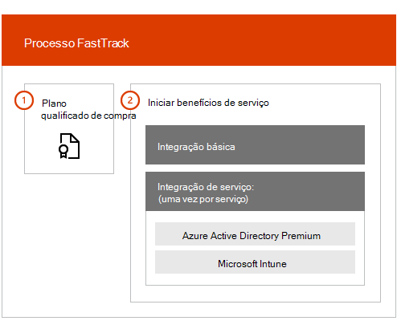

# Visão geral dos Benefícios do Centro FastTrack

Com o benefício do FastTrack Center para o Microsoft Azure Active Directory Premium, o Microsoft Intune e a proteção de informações do Azure, você trabalha remotamente com especialistas do FastTrack para preparar seu ambiente para uso e para planejar a distribuição e o uso em seu departamento. Para saber mais sobre a qualificação, confira [processo de benefícios do FastTrack Center para Enterprise Mobility + Security (EMS)](EMS-fasttrack-process.md).

A integração tem dois componentes principais:

-   Integração **básica** – tarefas necessárias para a configuração do locatário e integração com o Azure Active Directory, se necessário. A integração básica também fornece a linha de base para integração de outros serviços qualificados do Microsoft Online.

-   **Integração de serviço** – tarefas necessárias para configurar qualquer uma das variantes autônomas da carga de trabalho EMS (Azure ad Premium, Intune e proteção de informações do Azure).

O diagrama a seguir descreve as fases de integração de alto nível para o benefício do FastTrack Center.

Veja como funciona o processo:

- O FastTrack Center tenta contatá-lo para oferecer assistência de integração após a compra de licenças de um serviço qualificado. Você também pode solicitar assistência do [FastTrack Center](https://go.microsoft.com/fwlink/?linkid=780698) se estiver pronto para implantar esses serviços em sua organização. Para solicitar assistência, entre no [Centro FastTrack](https://go.microsoft.com/fwlink/?linkid=780698) com sua conta corporativa ou de estudante, vá para o painel, expanda o link **precisa de ajuda?** no canto inferior direito da página e siga os prompts para concluir a solicitação. Quando a integração começar, configuraremos um cronograma de reuniões online.

-   A equipe do FastTrack ajuda você primeiro com os principais recursos (comuns para todos os serviços online da Microsoft) e, em seguida, com a integração de cada serviço qualificado.

Todas as orientações de integração são fornecidas remotamente pelo pessoal do FastTrack atribuído:

-   A equipe do FastTrack o ajuda remotamente com várias atividades de integração usando uma combinação de ferramentas, documentação e orientação.

-   A orientação de integração é oferecida pelo FastTrack Center e está disponível durante o horário comercial normal de uma determinada região.

-   A assistência de integração está disponível em Chinês tradicional, chinês simplificado (os recursos falam apenas mandarim), inglês, francês, alemão, italiano, japonês, coreano, Português (Brasil), espanhol, tailandês e vietnamita.

-   A equipe do FastTrack pode trabalhar diretamente com você ou seu representante.

> [!NOTE]
> **Quer saber mais?** consulte [Enterprise Mobility + Security](https://www.microsoft.com/cloud-platform/enterprise-mobility).

## Próximas etapas

[Benefício do FastTrack Center para as expectativas do ambiente de origem EMS](EMS-source-environment-expectations.md)
