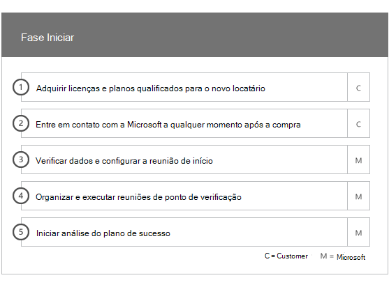
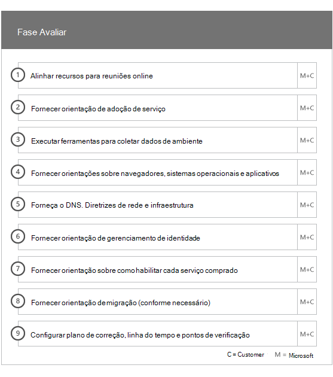
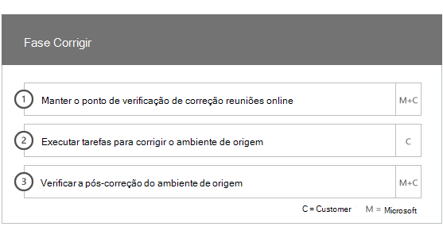
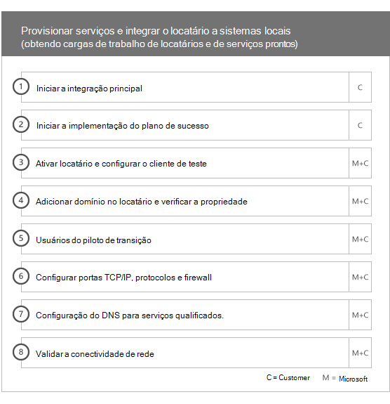
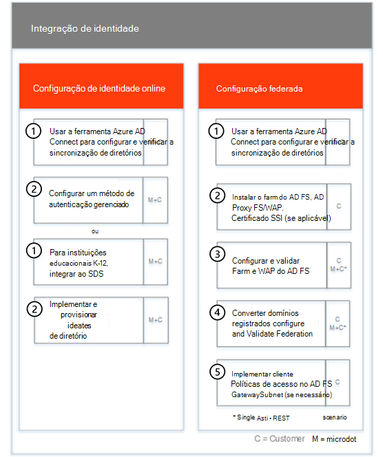
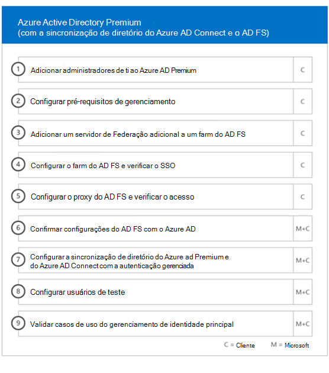
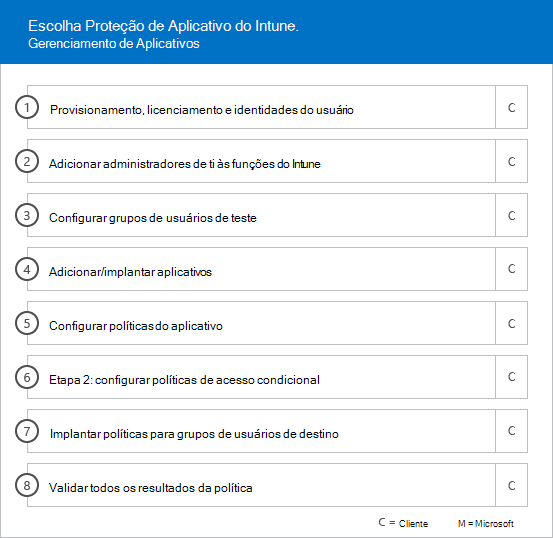
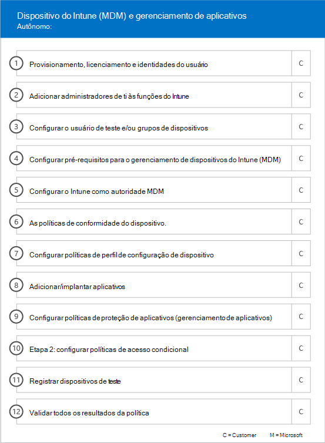

# Fases da IntegraçãoOnboarding Phases

> [!CAUTION]
> Este conteúdo não é mais atual e está agendado para remoção.This content is no longer current and is scheduled for removal. Use o Sumário na navegação à esquerda para o conteúdo atual.Use the table of contents in the left-hand navigation for current content.

Ao usar os serviços [e planos](M365-eligible-services-and-plans.md) qualificados para obter o Microsoft Azure Active Directory Premium, o Microsoft Intune e a proteção de informações do Azure prontos para uso, há várias fases envolvidas no processo.When you use the [Eligible Services and Plans](M365-eligible-services-and-plans.md) to get Microsoft Azure Active Directory Premium, Microsoft Intune, and Azure Information Protection ready for use, there are several phases involved in the process. As seções a seguir descrevem todas as fases do processo de integração.The following sections describe each phase of the onboarding process.

A integração tem quatro fases principais:Onboarding has four primary phases:

## Fase inicialInitiate phase

Após adquirir o número e tipos de licença apropriados, siga as orientações do email de confirmação de compra para associar as licenças ao seu locatário existente ou ao novo locatário.After you purchase the appropriate number of licenses, follow the guidance from the purchase confirmation email to associate the licenses to your existing tenant or new tenant. Em seguida, a Microsoft verifica a qualificação para os Benefícios do Centro FastTrack e tenta entrar em contato com você para oferecer assistência de integração.Microsoft then verifies your eligibility for the FastTrack Center Benefit and tries to contact you to offer onboarding assistance.

> [!NOTE]
> Você também pode solicitar assistência no [site do FastTrack](https://go.microsoft.com/fwlink/?linkid=780698) se estiver pronto para implantar esses serviços em sua organização.You can also request assistance from the [FastTrack site](https://go.microsoft.com/fwlink/?linkid=780698) if you're ready to deploy these services for your organization.

### Para solicitar assistênciaTo request assistance

1. Acesse o [site do FastTrack](https://go.microsoft.com/fwlink/?linkid=780698).Sign in to the [FastTrack site](https://go.microsoft.com/fwlink/?linkid=780698).
2. Selecione **Solicitar assistência para o Microsoft 365** nas **ações rápidas** na parte superior da sua página de destino ou selecionando **Solicitar assistência para o Microsoft 365** no cartão de implantação.Select **Request assistance for Microsoft 365** from the **quick actions** on the top of your landing page or by selecting **Request assistance for Microsoft 365** on the deploy card.
3. Preencha o formulário **Solicitar assistência para o Microsoft 365**.Complete the **Request Assistance for Microsoft 365 form**.

Assim que o suporte de integração for iniciado, definiremos um cronograma de reuniões online.Once onboarding support starts, we'll set up a schedule of online meetings.

Os parceiros da Microsoft também podem obter ajuda no [site do FastTrack](https://go.microsoft.com/fwlink/?linkid=780698) em nome de um cliente.Microsoft partners can also get help through the [FastTrack site](https://go.microsoft.com/fwlink/?linkid=780698) on behalf of a customer. Para fazer isso:To do so:

1. Acesse o [site do FastTrack](https://go.microsoft.com/fwlink/?linkid=780698).Sign in to the [FastTrack site](https://go.microsoft.com/fwlink/?linkid=780698).
2. Selecione **Meus Clientes**.Select **My Customers**.
3. Pesquise seu cliente ou selecione na lista de clientes.Search for your customer or select them from your customer list.
4. Selecione **Serviços**.Select **Services**.
5. Preencha o formulário **Solicitar assistência para o Microsoft 365**.Complete the **Request Assistance for Microsoft 365 form**.

Quando o suporte à integração começar, o FastTrack agendará uma programação de reuniões online com você para discutir o processo de integração, verificar dados e configurar uma reunião de lançamento.Once the onboarding support starts, FastTrack sets up a schedule of online meetings with you to discuss the onboarding process, verify data, and set up a kick-off meeting.

## Fase AvaliarAssess phase

Assim que o processo de integração começar, o Centro FastTrack trabalhará com você para avaliar o seu ambiente de origem e seus requisitos.Once the onboarding process begins, the FastTrack Center works with you to assess your source environment and the requirements. As ferramentas são executadas para avaliar o seu ambiente e os especialistas do FastTrack orientam você durante a avaliação do seu Active Directory local, navegadores da Internet, sistemas operacionais de dispositivos do cliente, DNS (sistema de nomes de domínio), rede, infraestrutura e sistema de identidade para determinar se as alterações são necessárias para integração.Tools are run to assess your environment, and FastTrack Specialists guide you through assessing your on-premises Active Directory, Internet browsers, client devices' operating systems, Domain Name System (DNS), network, infrastructure, and identity system to determine if any changes are required for onboarding.

O Centro FastTrack também conecta você com orientações sobre como direcionar a adoção bem-sucedida dos serviços qualificados.The FastTrack Center also connects you with guidance about how to drive successful adoption of the eligible services.

Baseado em suas configuração atual, fornecemos um plano de correção que leva seu ambiente de origem aos requisitos mínimos para uma integração bem-sucedida ao EMS ou aos seus serviços de nuvem individuais.Based on your current setup, we provide a remediation plan that brings your source environment up to the minimum requirements for successful onboarding to EMS or its individual cloud services. Também configuramos as chamadas apropriadas do ponto de verificação para a fase de correção.We also set up appropriate checkpoint calls for the remediation phase.

## Fase de correçãoRemediate phase
Execute as tarefas do plano de correção no ambiente de origem para atender aos requisitos de integração e adoção de cada serviço (caso necessário).You perform the tasks in the remediation plan on your source environment so that you meet the requirements for onboarding and adopting each service (as needed).

Antes de começar a fase Habilitar, verificaremos em conjunto os resultados das atividades de correção para garantir que você está pronto para continuar.Before you begin the Enable phase, we jointly verify the outcomes of the remediation activities to make sure you're ready to proceed.

## Fase HabilitarEnable phase
Quando todas as atividades de correção estiverem concluídas, o projeto passa a configurar a infraestrutura básica para o consumo do serviço e para provisionar cada serviço de nuvem do EMS qualificado.When all remediation activities are complete, the project shifts to configuring the core infrastructure for service consumption and to provisioning each eligible EMS cloud service.

**Fase Habilitar: Funcionalidades básicas****Enable phase - Core capabilities**

A integração básica envolve o provisionamento do serviço e a integração de identidade e locatário.Core onboarding involves service provisioning and tenant and identity integration. Ele também inclui etapas para fornecer uma base para integração de serviços online, como o Azure AD Premium, o Intune e a proteção de informações do Azure.It also includes steps for providing a foundation for onboarding online services like Azure AD Premium, Intune, and Azure Information Protection.

> [!NOTE]
> WAP significa Web Application Proxy (Proxy de Aplicativo da Web). SSL significa Secure Sockets Layer (Camada de Soquetes Seguros). SDS significa School Data Sync (Sincronização de Dados Escolares). Para saber mais sobre SDS, confira [Bem-vindo ao Microsoft School Data Sync](https://go.microsoft.com/fwlink/?linkid=871480).WAP stands for Web Application Proxy. SSL stands for Secure Sockets Layer. SDS stands for School Data Sync. For more information on SDS, see [Welcome to Microsoft School Data Sync](https://go.microsoft.com/fwlink/?linkid=871480).

> [!NOTE]
> Um método de autenticação gerenciada inclui, mas não se limita a sincronização de hash de senha.A managed authentication method includes, but is not limited to password hash synchronization. A integração de identidade é uma atividade ocasional e não inclui migração ou descomissionamento de métodos de autenticação existentes, como gerenciados ou federados.Identity integration is a one time activity and does not include migrating or decommissioning of existing authentication methods, such as managed or federated.

### Fase habilitar Azure AD PremiumEnable phase - Azure AD Premium

O ambiente do Azure AD Premium pode ser configurado usando a ferramenta de sincronização de diretório do Azure Active Directory Connect e os serviços de Federação do Active Directory(AD FS) (conforme necessário).The Azure AD Premium environment can be set up by using the Azure Active Directory Connect tool directory synchronization and Active Directory Federation Services (AD FS) (as needed).

Para cenários do Azure AD Premium que incluem a sincronização de identidades locais para a nuvem, podemos ajudá-lo a adicionar administradores de TI e usuários à sua assinatura, configurar os pré-requisitos de gerenciamento, configurar o Azure AD Premium, configurando o diretório de sincronização com autenticação gerenciada e AD FS usando a ferramenta Azure AD Connect, configurando os usuários do teste e validando seus principais casos de uso para o serviço.For Azure AD Premium scenarios that include synchronizing on-premises identities to the cloud, we help you by adding IT admins and users to your subscription, configuring management prerequisites, setting up Azure AD Premium, setting up directory synchronization with managed authentication and AD FS using the Azure AD Connect tool, configuring test users, and validating your core use cases for the service.

A configuração do Azure AD Premium inclui os recursos a seguir:Azure AD Premium setup includes enabling the following features:

-   Autoatendimento de Redefinição de Senha do Azure Active Directory (SSPR).Azure Active Directory Self-Service Password Reset (SSPR).

-   Autenticação Multifator do Azure (Azure MFA).Azure Multi-Factor Authentication (Azure MFA).

-   Até três (3) ou mais integrações de aplicativos de Software como um serviço (SaaS) com Logon Único (SSO) do [Azure Active Directory Marketplace](https://azure.microsoft.com/marketplace/active-directory/).Up to three (3) or more Software as a Service (SaaS) application integrations with Single Sign-On (SSO) from the [Azure Active Directory Marketplace](https://azure.microsoft.com/marketplace/active-directory/).

-   Provisionamento automático do usuário para aplicativos SaaS pré-instalados, como listados na [Lista de tutoriais de integração de aplicativost](https://docs.microsoft.com/azure/active-directory/saas-apps/tutorial-list), limitado apenas ao provisionamento de saída.Automatic user provisioning for pre-integrated SaaS applications as listed in the [App integration tutorial list](https://docs.microsoft.com/azure/active-directory/saas-apps/tutorial-list), limited to outbound provisioning only.

-   Tela de logon personalizada, incluindo logotipo, texto e imagens.Customized logon screen, including logo, text, and images.

-   Autoatendimento e Grupos Dinâmicos (Grupos).Self-Service and Dynamic Groups (Groups).

-   Proxy de Aplicativo do Azure Active Directory.Azure Active Directory Application Proxy.

-   Azure Active Directory Connect Health.Azure Active Directory Connect Health.

-   Acesso Condicional do Azure Active Directory.Azure Active Directory Conditional Access.

-   Termos de uso do Azure Active Directory.Azure Active Directory Terms of Use.

-   Proteção de identidade do Azure Active Directory.Azure Active Directory Identity Protection.

-   Azure Active Directory Privileged Identity Management.Azure Active Directory Privileged Identity Management.

-   Revisões de Acesso do Azure Active Directory.Azure Active Directory Access Reviews.

-   Proteção de senha do Azure Active Directory.Azure Active Directory Password Protection.

-   B2B do Azure Active Directory.Azure Active Directory B2B.

### Fase de Habilitação – IntuneEnable phase - Intune

Para o Intune, vamos orientá-lo a começar a usar o Microsoft Intune para gerenciar dispositivos.For Intune, we guide you through getting ready to use Microsoft Intune to manage devices. As etapas exatas dependem do ambiente de origem e se baseiam nas necessidades de gerenciamento de aplicativos móveis e de dispositivos móveis.The exact steps depend on your source environment and are based on your mobile device and mobile app management needs. As etapas podem incluir:The steps can include:

-   Licenciamento para os usuários finais.Licensing your end users. Além disso, fornecemos assistência sobre como ativar licenças por volume para o locatário do serviço de nuvem da Microsoft (conforme necessário).We also provide assistance on how to activate volume licenses for your Microsoft cloud service tenant (as needed).

-   Configuração de identidades a serem usadas pelo Intune, aproveitando o Active Directory local ou as identidades de nuvem.Configuring identities to be used by Intune by leveraging either your on-premises Active Directory or cloud identities.

-   Adição de usuários à sua assinatura do Intune, definição de funções de administrador de TI e criação de grupos de dispositivos e usuários.Adding users to your Intune subscription, defining IT admin roles, and creating user and device groups.

-   Configuração da autoridade de Gerenciamento de Dispositivo Móvel (MDM), com base em suas necessidades de gerenciamento, incluindo:Configuring your Mobile Device Management (MDM) authority, based on your management needs, including:

    -   Configure o Intune como sua autoridade MDM quando o Intune for sua única solução MDM.Setting Intune as your MDM authority when Intune is your only MDM solution.

-   Fornecendo instruções MDM para:Providing MDM guidance for:

    -   Configuração de grupos de testes a serem usados para validar as políticas de gerenciamento do MDM.Configuring tests groups to be used to validate MDM management policies.

    -   Configuração do gerenciamento das políticas e serviços do MDM, como:Configuring MDM management policies and services like:

        -   Implantação de aplicativos para cada plataforma com suporte por meio de links da web ou links profundos.Application deployment for each supported platform through web links or deep links.

        -   Políticas de acesso condicional.Conditional access policies.

        -   Implantação de email, redes sem fio e perfis VPN se tiver uma autoridade de certificação existente, uma infraestrutura de rede Wi-Fi ou VPN em sua organização.Deployment of email, wireless networks, and virtual private network (VPN) profiles if you have an existing  certificate authority, Wi-Fi or VPN infrastructure in your organization.

        -   Configuração do Microsoft Intune Exchange Connector (quando aplicável).Setting up the Microsoft Intune Exchange Connector (when applicable).

        -   Conexão ao Intune Data Warehouse.Connecting to Intune Data Warehouse

        -   Integração do Intune com:Integrating Intune with:
            -   O Team Viewer para assistência remota (É necessária a assinatura do Team Viewer).Team Viewer for remote assistance (Team viewer subscription is required).

            -   Soluções para parceiros de proteção de ameaças móveis (MTD) (É necessária a assinatura de Defesa contra Ameaças Móveis).Mobile Threat Defense (MTD) partner solutions (Mobile Threat Defense subscription is required).

            -   Soluções de gerenciamento de despesas de telecomunicações (É necessário a assinatura de solução de gerenciamento de despesas de telecomunicações).Telecom expense management solution (Telecom expense management solution subscription is required).

            -   Proteção Avançada Contra Ameaças do Microsoft Defender (são necessárias licenças do Windows E5 ou Microsoft 365 E5).Microsoft Defender Advanced Threat Protection (Windows E5 or Microsoft 365 E5 licenses are required).

    -   Registrando dispositivos de todas [as plataformas](https://technet.microsoft.com/library/dn600287.aspx) compatíveis com o Intune.Enrolling devices of each [supported platform](https://technet.microsoft.com/library/dn600287.aspx) to Intune.

-   Fornecendo diretrizes de proteção de aplicativos em:Providing App Protection guidance on:

    -   Configuração e implantação das políticas de proteção de aplicativo para cada plataforma com suporte.Configuring app protection policies for each supported platform.

    -   Configurar políticas de acesso condicional para aplicativos gerenciados.Configuring conditional access policies for managed apps.

    -   Direcionar os grupos de usuários apropriados com as políticas de MAM acima.Targeting the appropriate user groups with the above MAM policies.

    -   Usando relatórios de uso de aplicativos gerenciados.Using managed-applications usage reports.

-   Fornecendo diretrizes de gerenciamento de computador em:Providing PC management guidance on:

    -   Instalar o software cliente do Intune (quando necessário).Installing the Intune client software (when needed).

    -   Usando os relatórios de software e hardware disponíveis no Intune.Using the software and hardware reports available in Intune.

    > [!IMPORTANT]
    > O FastTrack não dá suporte ao gerenciamento clássico de computador do Windows 10 com o Intune.FastTrack does not support Windows 10 classic PC management with Intune. O FastTrack é compatível apenas com o gerenciamento do dispositivo do Windows 10 por meio do serviço de gerenciamento de dispositivo móvel do Intune (MDM).FastTrack only supports Windows 10 device management through Intune mobile device management (MDM).

#### Windows AutopilotWindows Autopilot

O FastTrack pode ajudar a simplificar o provisionamento de dispositivos com o piloto automático do Windows e o Intune, fornecendo novos dispositivos para seus usuários finais sem a necessidade de criar, manter e aplicar imagens personalizadas do sistema operacional aos seus dispositivos.FastTrack can help you through simplifying your device provisioning with Windows Autopilot and Intune by giving new devices to your end users without the need to build, maintain and apply custom operating system images to your devices.

O FastTrack é compatível com os seguintes cenários de piloto automático:FastTrack supports the following Autopilot scenarios:

- **Autoatendimento do Azure AD:** os dispositivos entram no Azure AD e se inscrevem no Intune.**Azure AD self-service:** Devices join Azure AD and enroll into Intune. Esse cenário tem suporte ao usar o Windows 10 1703 e as versões mais recentes.This scenario is supported when using Windows 10 1703 and latest versions.

- **Autoatendimento do AAD híbrido:** os dispositivos entram no AD local e no Azure AD e se inscrevem no Intune.**Hybrid AAD self-service:** Devices join both on-premises AD and Azure AD and enroll into Intune. Esse cenário tem suporte ao usar o Windows 10 1809 e as versões mais recentes.This scenario is supported when using Windows 10 1809 and latest versions.

- **Autoprovisionagem:** os dispositivos entram automaticamente no Azure AD.**Self-provisioning:** Devices automatically join Azure AD. Esse cenário tem suporte ao usar o Windows 1809 e as versões mais recentes.This scenario is supported when using Windows 1809 and latest versions.

    > [!IMPORTANT]
    > O FastTrack não dá suporte a cenários de piloto automático iniciados pelo Configuration Manager.FastTrack does not support Autopilot scenarios initiated from Configuration Manager.

As etapas para configurar o piloto automático do Windows dependem do seu ambiente de origem e podem incluir:The steps to setup Windows Autopilot depends on your source environment and it can include:

- Configuração e instalação do Microsoft Intune para Windows Autopilot.Configure and setup Microsoft Intune for Windows Autopilot.

- Configuração dos grupos de Azure AD Dynamic Configure Azure AD dynamic groups

- Adição da marca da sua Empresa no Azure AD.Add your Company branding into Azure AD.

- Criação e atribuição de dispositivos aos perfis do Windows Autopilot (por exemplo, um perfil do Windows Autopilot que restringe a criação de contas de Administrador Local).Create and assign devices to Windows Autopilot profiles (e.g a Windows Autopilot profile that restricts Local Administrator account creation).

- Personalização da experiência inicial (OOBE) para ser compatível com os requisitos da organização.Customize the Out-of-box-experience (OOBE) to comply with organization's requirements.

- Configuração do registro automático MDM no Azure AD e no Intune.Configuring MDM Auto-enrollment in Azure AD and Intune.

#### Implantar o Outlook para iOS e Android com segurança.Deploy Outlook for iOS and Android securely

O FastTrack pode ajudar a implantar o Outlook para iOS e Android com segurança em sua organização, para garantir que os usuários tenham todos os aplicativos necessários instalados.FastTrack can help you by deploying Outlook for iOS and Android securely in your organization to ensure your users have all the required apps installed.

As etapas para implantar o Outlook Mobile para iOS e Android com Intune dependem do seu ambiente de origem e podem incluir:The steps to securely deploy Outlook Mobile for iOS and Android with Intune depends on your source environment and it can include:

- Baixe o Outlook para iOS e Android, o Microsoft Authenticator e o aplicativo portal da empresa do Intune por meio da Apple App Store ou do Google Play Store.Download Outlook for iOS and Android, Microsoft Authenticator and the Intune Company portal app via the Apple App Store or Google Play Store.
- Fornece orientação sobre a configuração:Also provide guidance on setting up:
    - Outlook para iOS e Android, o Microsoft Authenticator e a implantação do aplicativo portal da empresa com o Intune.Outlook for iOS and Android, Microsoft Authenticator and the Intune Company portal app deployment with Intune.
    - Políticas de proteção de aplicativosApp protection policies
    - Políticas de acesso condicionalConditional access policies
    - Políticas de configuração do usuárioApp configuration policies

    > [!IMPORTANT]
    > A equipe FastTrack não é compatível com a proteção do Outlook para iOS e Android com as políticas de caixa de correio de dispositivo móvel do Exchange.FastTrack team does not support securing Outlook for iOS and Android with Exchange mobile device mailbox policies.

#### Vincular à nuvemCloud-attach

O FastTrack guia você para se preparar para vincular ambientes existentes do Gerenciador de Configurações à nuvem com o Intune.FastTrack guides you through getting ready to cloud-attach existing Configuration Manager environments with Intune. As etapas exatas dependem do ambiente de origem.The exact steps depend on your source environment. Essas etapas podem incluir:These steps can include:

- Explicar os benefícios de vincular o Configuration Manager à nuvem com o Intune.Explaining the benefits of cloud-attaching Configuration Manager with Intune.

- Licenciamento para os usuários finais.Licensing your end users. O FastTrack também oferece assistência sobre como ativar licenças por volume para o locatário do serviço de nuvem da Microsoft (conforme necessário).FastTrack also provides assistance on how to activate volume licenses for your Microsoft cloud service tenant (as needed).

- A configuração de identidades que será usada pelo Intune, aproveitando o Active Directory local e as identidades de nuvem.Configuring identities to be used by Intune by leveraging your on-premises Active Directory and cloud identities.

- Adição de usuários à sua assinatura do Intune, definição de funções de administrador de TI e criação de grupos de dispositivos e usuários.Adding users to your Intune subscription, defining IT admin roles, and creating user and device groups.

- Habilitação de vinculação à nuvem no console do Configuration Manager.Enabling cloud-attach in the Configuration Manager console.

- Fornecimento de diretrizes de configuração da associação híbrida do Azure Active Directory.Providing guidance setting up hybrid Azure Active Directory Join.

- Fornecimento de diretrizes para configuração do Azure Active Directory para o registro automático do MDM.Providing guidance on setting up Azure Active Directory for MDM auto-enrollment.

- Fornecimento de diretrizes sobre como configurar o gateway de gerenciamento de nuvem.Providing guidance on how to set up cloud management gateway.

- Configuração de cargas de trabalho compatíveis que você deseja passar para o Intune.Configuring supported workloads that you want to switch to Intune.

- Instalação do cliente do Configuration Manager em dispositivos registrados no Intune.Installing the Configuration Manager client on Intune-enrolled devices.

O FastTrack também fornece diretrizes sobre como direcionar a adoção bem-sucedida dos serviços qualificados.FastTrack also provides guidance on how to drive successful adoption of the eligible services.

 

#### Fase de habilitação – Proteção de Informações do AzureEnable phase – Azure Information Protection

Os clientes têm orientação sobre como:Customers are provided guidance on how to: 

- Ativar e configurar o locatário.Activate and configure their tenant.
- Criar e configurar rótulos e políticas.Create and set up labels and policies.
- Aplicação de proteção de informações aos documentos.Apply information protection to documents. 
- Classificação e rotulação automática de informações em aplicativos do Office (como Word, PowerPoint, Excel e Outlook) em execução no Windows e que usam o Cliente da Proteção de Informações do Azure.Automatically classify and label information in Office apps (like Word, PowerPoint, Excel, and Outlook) running on Windows and using the Azure Information Protection client.
- Uso de arquivos em repouso com o scanner da Proteção de Informações do Azure.Use files at rest using the Azure Information Protection scanner.
- Monitoramento de emails em trânsito usando as regras de fluxo de email do Exchange Online.Monitor emails in transit using Exchange Online mail flow rules.

As orientações também são fornecidas aos clientes que desejam aplicar a proteção usando Serviços de Gerenciamento de Direitos do Microsoft Azure (Azure RMS), Criptografia de Mensagens do Office 365 (OME) e Prevenção Contra Perda de Dados (DLP).Guidance is also provided to customers who want to apply protection using Microsoft Azure Rights Management Services (Azure RMS), Office 365 Message Encryption (OME), and data loss prevention (DLP).

> [!NOTE]
> **Quer saber mais?**, consulte[Enterprise Mobility + Security](https://www.microsoft.com/cloud-platform/enterprise-mobility).**Want to learn more?** see [Enterprise Mobility + Security](https://www.microsoft.com/cloud-platform/enterprise-mobility).

## Próximas etapasNext steps

[Benefícios do FastTrack para EMS – Responsabilidades da MicrosoftFastTrack benefit for EMS - Microsoft responsibilities](EMS-fasttrack-responsibilities.md)

