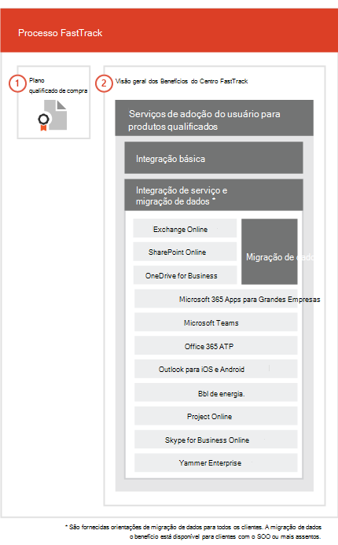

# O processo FastTrack

O processo FastTrack oferece integração e serviços de adoção do usuário.  
  
A integração consiste em:
  
- *Core onboarding* — These are tasks required for tenant configuration and integration with Azure Active Directory (Azure AD) if needed. Core onboarding also provides the baseline for onboarding other eligible services. 
- *Service onboarding and migration* — Service onboarding tasks enable scenarios in your tenant. Data migration (including email and files) is covered in [Data Migration](O365-data-migration.md). 
    
User adoption services are comprised of tasks that provide guidance for you to ensure your users are aware of the eligible services and can use them to drive business value. This assistance occurs in parallel to onboarding activities.
  
> [!NOTE]
> FastTrack provides customers with a recommended approach, guidance, and best practices engineered to deliver quick and predictable outcomes. If you choose to deploy outside of this guidance, your onboarding experience and usage of the service may be impacted. Guidance is defined as a combination of verbal and written assistance. When FastTrack Specialists provide guidance, FastTrack personnel cannot act on your behalf. You can use FastTrack services to onboard and adopt any qualifying product workload as long as your subscription is current. 
  
## O processo de integração

O diagrama a seguir ilustra o processo de integração.
  

  
Você pode obter ajuda no [centro de administração do Microsoft 365](https://go.microsoft.com/fwlink/?linkid=2032704) ou no [site do FastTrack](https://go.microsoft.com/fwlink/?linkid=780698). 

Para obter ajuda pelo [centro de administração do Microsoft 365](https://go.microsoft.com/fwlink/?linkid=2032704), o administrador deve entrar no centro de administração e clicar no widget **Precisa de ajuda?**. 

Para obter ajuda no [site do FastTrack](https://go.microsoft.com/fwlink/?linkid=780698): 
1.    Acesse o [site do FastTrack](https://go.microsoft.com/fwlink/?linkid=780698). 
2.    Selecione **Solicitar assistência para o Microsoft 365** nas **ações rápidas** na parte superior da sua página de destino ou selecionando **Solicitar assistência para o Microsoft 365** no cartão de implantação.
3.    Preencha o formulário **Solicitar assistência para o Microsoft 365**. 
  
 Você pode também solicitar ajuda ao Centro FastTrack no [site do FastTrack](https://go.microsoft.com/fwlink/?linkid=780698), na lista de serviços disponíveis para o seu locatário. 
    
 Assim que a assistência de integração for iniciada, definiremos um cronograma de reuniões online.
    
Partners can also get help through the [FastTrack site](https://go.microsoft.com/fwlink/?linkid=780698) on behalf of a customer. To do so:
1.    Acesse o [site do FastTrack](https://go.microsoft.com/fwlink/?linkid=780698). 
2.    Selecione **Meus Clientes**.
3.    Pesquise seu cliente ou selecione na lista de clientes.
4.    Selecione **Serviços**.
5.    Preencha o formulário **Solicitar assistência para o Microsoft 365**. 

A tabela a seguir lista as funções e responsabilidades para o processo.
    
|||
|:-----|:-----|
|**Função**   |**Responsabilidade**   |
|**Especialista do FastTrack**   |Oferecem todos os serviços de integração, migração e adoção de usuário remotamente.    Ajuda remotamente usando uma combinação de ferramentas e documentação publicada.   Trabalha diretamente com você ou seu representante.   Fornece orientações para migração de emails e dados.|
|**Centro FastTrack**    |Oferece orientações com a integração principal e a de serviço, e o planejamento bem-sucedido da adoção de serviços qualificados.    Oferece assistência e está disponível durante o horário comercial normal de cada região.   Oferece assistência em chinês tradicional e em chinês simplificado (os recursos falam apenas mandarim), inglês, francês, alemão, italiano, japonês, coreano, português (Brasil), espanhol, tailandês e vietnamita.|
