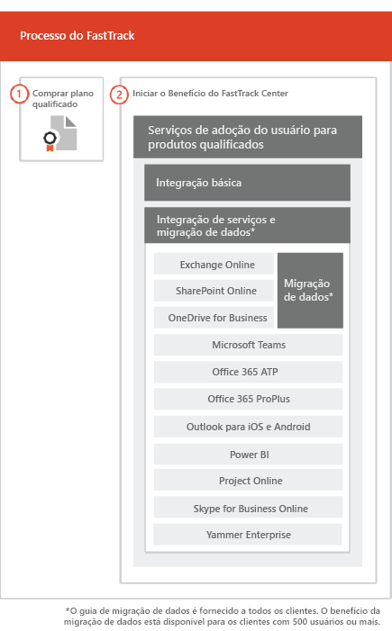

# O processo FastTrackThe FastTrack Process

O processo FastTrack oferece integração e serviços de adoção do usuário. The FastTrack process provides onboarding and user adoption services. 
  
A integração consiste em:Onboarding consists of:
  
- *Integração básica* – as tarefas necessárias para configuração de locatários e integração ao Azure Active Directory (Azure AD), se necessário. A integração básica também fornece a linha de base para integração de outros serviços qualificados.*Core onboarding* — These are tasks required for tenant configuration and integration with Azure Active Directory (Azure AD) if needed. Core onboarding also provides the baseline for onboarding other eligible services. 
- *Serviço de migração e integração* – as tarefas de integração de serviço habilitam cenários em seu locatário. A migração de dados (incluindo emails e arquivos) é abordada em [Migração de Dados](O365-data-migration.md).*Service onboarding and migration* — Service onboarding tasks enable scenarios in your tenant. Data migration (including email and files) is covered in [Data Migration](O365-data-migration.md). 
    
Os serviços de adoção do usuário são compostos por tarefas que oferecem orientações para garantir que os usuários estejam cientes dos serviços qualificados e de que podem usá-los para impulsionar o valor comercial. Esta assistência ocorre paralelamente às atividades de integração.User adoption services are comprised of tasks that provide guidance for you to ensure your users are aware of the eligible services and can use them to drive business value. This assistance occurs in parallel to onboarding activities.
  
> [!NOTE]
> O FastTrack oferece aos clientes uma abordagem recomendada, orientação e práticas recomendadas elaboradas para fornecer resultados rápidos e previsíveis. Se você optar por implantar de forma diferente dessa orientação, sua experiência de integração e o uso do serviço poderão ser afetados. A orientação é definida como uma combinação de assistência verbal e escrita. Quando os Especialistas do FastTrack oferecem orientação, o pessoal do FastTrack não pode atuar em seu nome. Você pode usar serviços do FastTrack para integrar e adotar qualquer carga de trabalho do produto qualificado, desde que sua assinatura seja atual.FastTrack provides customers with a recommended approach, guidance, and best practices engineered to deliver quick and predictable outcomes. If you choose to deploy outside of this guidance, your onboarding experience and usage of the service may be impacted. Guidance is defined as a combination of verbal and written assistance. When FastTrack Specialists provide guidance, FastTrack personnel cannot act on your behalf. You can use FastTrack services to onboard and adopt any qualifying product workload as long as your subscription is current. 
  
## O processo de integraçãoThe onboarding process

O diagrama a seguir ilustra o processo de integração.The following diagram illustrates the onboarding process.
  

  
Você pode obter ajuda no [centro de administração do Microsoft 365](https://go.microsoft.com/fwlink/?linkid=2032704) ou no [site do FastTrack](https://go.microsoft.com/fwlink/?linkid=780698).You can get help through the [Microsoft 365 admin center](https://go.microsoft.com/fwlink/?linkid=2032704) or the [FastTrack site](https://go.microsoft.com/fwlink/?linkid=780698). 

Para obter ajuda pelo [centro de administração do Microsoft 365](https://go.microsoft.com/fwlink/?linkid=2032704), o administrador deve entrar no centro de administração e clicar no widget **Precisa de ajuda?**.To get help through the [Microsoft 365 admin center](https://go.microsoft.com/fwlink/?linkid=2032704), your admin signs into the admin center and then clicks the **Need help?** widget. 

Para obter ajuda no [site do FastTrack](https://go.microsoft.com/fwlink/?linkid=780698):To get help through the [FastTrack site](https://go.microsoft.com/fwlink/?linkid=780698): 
1.  Acesse o [site do FastTrack](https://go.microsoft.com/fwlink/?linkid=780698).Sign in to the [FastTrack site](https://go.microsoft.com/fwlink/?linkid=780698). 
2.  Selecione **FastTrack**.Select **FastTrack**.
3.  Selecione **Serviços**.Select **Services**.
4.  Preencha o formulário **Solicitar assistência com o Microsoft 365**.Complete the **Request for Assistance with Microsoft 365** form. 
> [!NOTE]
>  Se você tiver um parceiro mencionado no locatário do Office 365, não verá essa opção. Consulte o seu parceiro para obter assistência.If you have a partner listed in your Office 365 tenant, you won't see this option. Please consult your partner for assistance. 
  
 Você pode também solicitar ajuda ao Centro FastTrack no [site do FastTrack](https://go.microsoft.com/fwlink/?linkid=780698), na lista de serviços disponíveis para o seu locatário.You can also ask for FastTrack Center help from the [FastTrack site](https://go.microsoft.com/fwlink/?linkid=780698) in the list of available services for your tenant. 
    
 Assim que a assistência de integração for iniciada, definiremos um cronograma de reuniões online.Once onboarding assistance starts, we set up a schedule of online meetings.
    
Os parceiros também podem obter ajuda no [site do FastTrack](https://go.microsoft.com/fwlink/?linkid=780698) em nome de um cliente da seguinte forma:Partners can also get help through the [FastTrack site](https://go.microsoft.com/fwlink/?linkid=780698) on behalf of a customer. To do so:
1.  Acesse o [site do FastTrack](https://go.microsoft.com/fwlink/?linkid=780698).Sign in to the [FastTrack site](https://go.microsoft.com/fwlink/?linkid=780698). 
2.  Selecione **FastTrack**.Select **FastTrack**.
3.  Selecione **Meus Clientes**.Select **My Customers**.
4.  Pesquise seu cliente ou selecione na lista de clientes.Search for your customer or select them from your customer list.
5.  Selecione **Serviços**.Select **Services**.
6.  Preencha o formulário **Solicitar assistência com o Microsoft 365**.Complete the **Request for Assistance with Microsoft 365** form. 

A tabela a seguir lista as funções e responsabilidades para o processo.The following table lists roles and responsibilities for the process.
    
|||
|:-----|:-----|
|**Função****Role**   |**Responsabilidade****Responsibility**   |
|**Especialista do FastTrack****FastTrack Specialist**   |Oferecem todos os serviços de integração, migração e adoção de usuário remotamente.Provides all onboarding, migration, and user adoption services remotely.    Ajuda remotamente usando uma combinação de ferramentas e documentação publicada.Assists you remotely by using a combination of tools and published documentation.   Trabalha diretamente com você ou seu representante.Works directly with you or your representative.   Fornece orientações para migração de emails e dados.Provides email and data migration guidance.|
|**Centro FastTrack****FastTrack Center**    |Oferece orientações com a integração principal e a de serviço, e o planejamento bem-sucedido da adoção de serviços qualificados.Provides guidance with core and service onboarding and planning successful adoption of eligible services.    Oferece assistência e está disponível durante o horário comercial normal de cada região.Provides assistance and is available during normal business hours for a given region.   Oferece assistência em chinês tradicional e em chinês simplificado (os recursos falam apenas mandarim), inglês, francês, alemão, italiano, japonês, coreano, português (Brasil), espanhol, tailandês e vietnamita.Provides assistance in Traditional Chinese and Simplified Chinese (resources speak Mandarin only), English, French, German, Italian, Japanese, Korean, Portuguese (Brazil), Spanish, Thai, and Vietnamese.|

  

