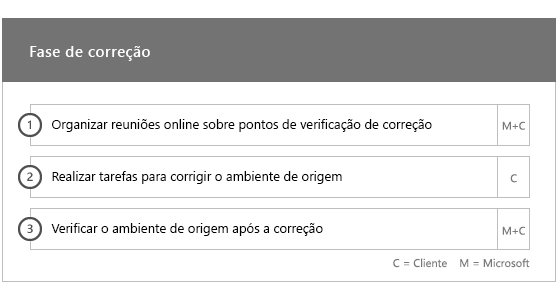
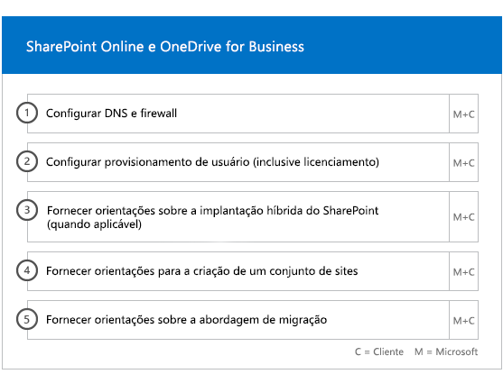
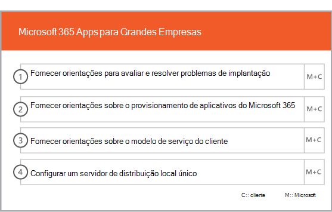

# Fases de integração e migraçãoOnboarding and Migration Phases

A integração do Office 365 tem quatro fases principais: Iniciar, Avaliar, Corrigir e Habilitar. Elas podem ser seguidas por uma fase opcional de migração de dados, como mostra a imagem a seguir.Office 365 onboarding has four primary phases—Initiate, Assess, Remediate, and Enable. You can follow these phases with an optional data migration phase as shown in the following figure.
  

  
> [!NOTE]
>Para saber mais sobre a adesão e migração para o Office 365 US Government, confira [Integração e migração para o Office 365 US Government](US-Gov-appendix-onboarding-and-migration.md).For information on onboarding and migration for Office 365 US Government, see [Onboarding and Migration for Office 365 US Government](US-Gov-appendix-onboarding-and-migration.md). 

Para tarefas detalhadas para cada fase, confira [Responsibilities do FastTrack](O365-fasttrack-responsibilities.md) e [Suas responsabilidades](O365-your-responsibilities.md).For detailed tasks for each phase, see [FastTrack Responsibilities](O365-fasttrack-responsibilities.md) and [Your Responsibilities](O365-your-responsibilities.md).
  
## Fase IniciarInitiate phase

Após adquirir o número e tipos de licença apropriados, siga as orientações do email de confirmação de compra para associar as licenças ao seu locatário existente ou ao novo locatário.After you purchase the appropriate number and types of licenses, follow the guidance from the purchase confirmation email to associate the licenses to your existing or new tenant. 
  
Você pode obter ajuda no [centro de administração do Microsoft 365](https://go.microsoft.com/fwlink/?linkid=2032704) ou no [site do FastTrack](https://go.microsoft.com/fwlink/?linkid=780698).You can get help through the [Microsoft 365 admin center](https://go.microsoft.com/fwlink/?linkid=2032704) or the [FastTrack site](https://go.microsoft.com/fwlink/?linkid=780698). 

Para obter ajuda pelo [centro de administração do Microsoft 365](https://go.microsoft.com/fwlink/?linkid=2032704), o administrador deve entrar no centro de administração e clicar no widget **Precisa de ajuda?**.To get help through the [Microsoft 365 admin center](https://go.microsoft.com/fwlink/?linkid=2032704), your admin signs into the admin center and then clicks the **Need help?** widget. 

Para obter ajuda no [site do FastTrack](https://go.microsoft.com/fwlink/?linkid=780698):To get help through the [FastTrack site](https://go.microsoft.com/fwlink/?linkid=780698): 
1.    Acesse o [site do FastTrack](https://go.microsoft.com/fwlink/?linkid=780698).Sign in to the [FastTrack site](https://go.microsoft.com/fwlink/?linkid=780698). 
2.    Selecione **Solicitar assistência para o Microsoft 365** nas **ações rápidas** na parte superior da sua página de destino ou selecionando **Solicitar assistência para o Microsoft 365** no cartão de implantação.Select **Request assistance for Microsoft 365** from the **quick actions** on the top of your landing page or by selecting **Request assistance for Microsoft 365** on the deploy card.
3.    Preencha o formulário **Solicitar assistência para o Microsoft 365**.Complete the **Request Assistance for Microsoft 365** form. 
  
Os parceiros também podem obter ajuda no [site do FastTrack](https://go.microsoft.com/fwlink/?linkid=780698) em nome de um cliente da seguinte forma:Partners can also get help through the [FastTrack site](https://go.microsoft.com/fwlink/?linkid=780698) on behalf of a customer. To do so:
1.    Acesse o [site do FastTrack](https://go.microsoft.com/fwlink/?linkid=780698).Sign in to the [FastTrack site](https://go.microsoft.com/fwlink/?linkid=780698). 
2.    Selecione **Meus Clientes**.Select **My Customers**.
3.    Pesquise seu cliente ou selecione na lista de clientes.Search for your customer or select them from your customer list.
4.    Selecione **Serviços**.Select **Services**.
5.    Preencha o formulário **Solicitar assistência para o Microsoft 365**.Complete the **Request Assistance for Microsoft 365** form.

Você pode também solicitar ajuda ao Centro FastTrack no [site do FastTrack](https://go.microsoft.com/fwlink/?linkid=780698), na lista de serviços disponíveis para o seu locatário.You can also ask for FastTrack Center help from the [FastTrack site](https://go.microsoft.com/fwlink/?linkid=780698) in the list of available services for your tenant. 
    
Durante essa fase, podemos discutir o processo de integração, verificar seus dados e configurar uma reunião inicial. Isso inclui trabalhar em conjunto para entender como você pretende usar o serviço e quais são as metas e planos da organização para impulsionar o uso do serviço.During this phase, we discuss the onboarding process, verify your data, and set up a kickoff meeting. This includes working with you to understand how you intend to use the service and your organization's goals and plans to drive service usage.
  

  
## Fase AvaliarAssess phase

O Gerente do FastTrack realiza uma chamada interativa de planejamento com você e sua equipe de adoção. Apresentamos os recursos dos serviços qualificados adquiridos, as principais bases necessárias para o sucesso, a metodologia para incentivar o uso do serviço e os cenários que você pode usar para aproveitar os serviços. Podemos ajudá-lo no planejamento de sucesso e fornecer comentários sobre as áreas principais (conforme necessário).Your FastTrack Manager conducts an interactive success planning call with you and your adoption team. This introduces you to the capabilities of the eligible services you purchased, the key foundations you need for success, the methodology for driving usage of the service, and scenarios you can use to get value from the services. We assist you in success planning and provide feedback on key areas (as needed).
  
Os Especialistas do FastTrack trabalham com você para avaliar seu ambiente de origem e seus requisitos. Fornecemos ferramentas para recolher dados sobre o seu ambiente e damos orientações através da estimativa dos requisitos de largura de banda e da avaliação de seus navegadores da Internet, sistemas operacionais clientes, DNS (sistema de nomes de domínio), rede, infraestrutura e sistema de identidade para determinar se é necessário fazer alterações antes da integração.FastTrack Specialists work with you to assess your source environment and the requirements. We provide tools for you to gather data about your environment and  guide you through estimating bandwidth requirements and assessing your internet browsers, client operating systems, Domain Name System (DNS), network, infrastructure, and identity system to determine if any changes are required for onboarding. 
  
Baseado em suas configurações atuais, fornecemos um plano de correção que define seu ambiente de origem, conforme os requisitos mínimos para a integração ao Office 365 e, se necessário, para a migração de caixas de correio e/ou dados ocorrer com êxito. Oferecemos um conjunto de atividades sugeridas para aumentar a adoção e o valor do usuário final. Também configuramos chamadas de ponto de verificação adequadas para a fase Corrigir.Based on your current setup, we provide a remediation plan that brings your source environment up to the minimum requirements for successful onboarding to Office 365 and, if needed, for successful mailbox and/or data migration. We provide a set of suggested activities to increase end user value and adoption. We also set up appropriate checkpoint calls for the Remediate phase.
  

  
## Fase CorrigirRemediate phase

Você realiza as tarefas do plano de correção baseadas no seu ambiente de origem, a fim de cumprir os requisitos necessários para integrar, adotar e migrar cada serviço.You do the remediation tasks based on your source environment so that you meet the requirements for onboarding, adopting, and migrating each service as needed.
  

  
Também fornecemos um conjunto de atividades sugeridas para aumentar a adoção e o valor do usuário final. Antes de começar a fase Habilitar, verificaremos em conjunto os resultados das atividades de correção para garantir que você está pronto para continuar.We also provide a set of suggested activities to increase end user value and adoption. Before beginning the Enable phase, we jointly verify the outcomes of the remediation activities to make sure you're ready to proceed. 
  
Durante esta fase, o Gerente do FastTrack trabalha com você no planejamento de sucesso, mostrando os recursos corretos e práticas recomendadas para fornecer orientações de forma a disponibilizar o serviço para sua organização e incentivar o uso entre os serviços.During this phase, your FastTrack Manager works with you on success planning, guiding you to the right resources and best practices to provide guidance for you to make the service available to your organization and drive usage across the services.
  
## Fase HabilitarEnable phase

Quando todas as atividades de correção estiverem concluídas, o foco passará a ser configurar a infraestrutura básica para o consumo de serviço, provisionando o Office 365 e conduzindo as atividades para gerar adoção do serviço.When all remediation activities are complete, the focus shifts to configuring the core infrastructure for service consumption, provisioning Office 365, and conducting the activities to drive service adoption. 
  
## Serviços básicosCore

A integração básica envolve o provisionamento do serviço e a integração de identidade e locatário. Também inclui etapas para fornecer uma base para serviços de integração como o Exchange Online, o SharePoint Online e o Skype for Business Online. Você e seu Gerente do FastTrack continuam a ser eficazes no planejamento de reuniões de status para avaliar o progresso em relação às metas e determinar a ajuda adicional que você precisa.Core onboarding involves service provisioning and tenant and identity integration. It also includes steps for providing a foundation for onboarding services like Exchange Online, SharePoint Online, and Skype for Business Online. You and your FastTrack Manager continue to have success planning checkpoint meetings to evaluate progress against your goals and determine what further assistance you need.
  

  

  
> [!NOTE]
> WAP significa Web Application Proxy (Proxy de Aplicativo da Web). SSL significa Secure Sockets Layer (Camada de Soquetes Seguros). SDS significa School Data Sync (Sincronização de Dados Escolares). Para saber mais sobre SDS, confira [Bem-vindo ao Microsoft School Data Sync](https://go.microsoft.com/fwlink/?linkid=871480).WAP stands for Web Application Proxy. SSL stands for Secure Sockets Layer. SDS stands for School Data Sync. For more information on SDS, see [Welcome to Microsoft School Data Sync](https://go.microsoft.com/fwlink/?linkid=871480). 
  
A integração de um ou mais serviços qualificados poderá começar quando a integração básica estiver concluída.Onboarding for one or more eligible services can begin once core onboarding is finished.
  
## Exchange OnlineExchange Online

Em relação ao Exchange Online, vamos orientá-lo pelo processo de modo que sua organização fique pronta para usar o email. As etapas exatas, de acordo com o ambiente de origem e os planos de migração de email, podem incluir orientações para:For Exchange Online, we guide you through the process to get your organization ready to use email. The exact steps, depending on your source environment and your email migration plans, can include providing guidance for:
- Configurar os recursos do EOP (Proteção do Exchange Online) para todos os domínios habilitados para email validados no Office 365.Setting up Exchange Online Protection (EOP) features for all mail-enabled domains validated in Office 365.
    > [!NOTE]
    > Seus registros de Troca de Mensagens (Mail Exchange, MX) devem apontar para o Office 365.Your mail exchange (MX) records must point to Office 365. 
- Configurar o recurso de Proteção Avançada Contra Ameaças do Office 365 (ATP) se ele fizer parte do seu serviço de assinatura.Setting up the Office 365 Advanced Threat Protection (ATP) feature if it's part of your subscription service. Para obter mais informações, confira[Proteção avançada contra ameaças do Office365](#office-365-advanced-threat-protection).For more information, see [Office 365 Advanced Threat Protection](#office-365-advanced-threat-protection).
- Configurar o recurso de DLP (prevenção contra perda de dados) para todos os domínios habilitados para email validados no Office 365 como parte do serviço de assinatura. Isso é feito quando seus registros MX apontam para o Office 365.Setting up the data loss prevention (DLP) feature for all mail-enabled domains validated in Office 365 as part of your subscription service. This is done once your MX records point to Office 365.
- Configurar o recurso de OME (Criptografia de Mensagens do Office 365) para todos os domínios habilitados para email validados no Office 365 como parte do serviço de assinatura. Isso é feito quando seus registros MX apontam para o Office 365.Setting up Office 365 Message Encryption (OME) for all mail-enabled domains validated in Office 365 as part of your subscription service. This is done once your MX records point to Office 365.

> [!NOTE]
> O serviço de Replicação de Caixa de Correio (MRS) tenta migrar os emais do Gerenciamento de Direitos de Informação (IRM) da caixa de correio local para a caixa de correio correspondente do Exchange Online.The Mailbox Replication service (MRS) attempts to migrate Information Rights Managed (IRM) emails from your on-premises mailbox to the corresponding Exchange Online mailbox. A capacidade de ler o conteúdo protegido após a migração depende dos modelos de mapeamento e cópia do cliente dos Serviços Gerenciados por Direitos do Active Directory (AD RMS) para o Serviço de Gerenciamento de Direitos do Azure (Azure RMS).Ability to read the protected content post-migration depends on the customer mapping and copying Active Directory Rights Managed Services (AD RMS) templates to the Azure Rights Management Service (Azure RMS).

- Configuração das portas do firewall.Configuring firewall ports.
- Configurar o DNS, incluindo a Descoberta Automática exigida, o SPF (Sender Policy Framework) e os registros MX (conforme necessário).Setting up DNS, including the required Autodiscover, sender policy framework (SPF), and MX records (as needed). 
- Configurando o fluxo de email entre seu ambiente de mensagens de origem e o Exchange Online (conforme a necessidade).Setting up email flow between your source messaging environment and Exchange Online (as needed).
- Fornecer orientações para a migração de email do ambiente de mensagens de origem para o Office 365.Undertaking mail migration from your source messaging environment to Office 365.
- Configuração de clientes de caixa de correio (Outlook para Windows, Outlook na web e Outlook para iOS e Android).Configuring mailbox clients (Outlook for Windows, Outlook on the web, and Outlook for iOS and Android).
    > [!NOTE]
    > Para saber mais sobre a migração de dados e emails, confira [Migração de dados](O365-data-migration.md).For more information on mail and data migration, see [Data Migration](O365-data-migration.md). 
  

  
## SharePoint Online e OneDrive for BusinessSharePoint Online and OneDrive for Business

No SharePoint Online e OneDrive for Business, fornecemos instruções para:For SharePoint Online and OneDrive for Business, we provide guidance for:
- Configuração do DNS.Setting up DNS.
- Configurar portas do firewall.Configuring firewall ports.
- Provisionar usuários e licenças.Provisioning users and licenses.   
- Configurar recursos híbridos do SharePoint, como pesquisa híbrida, sites híbridos, taxonomia híbrida, tipos de conteúdo, criação de sites de autoatendimento híbridos (SharePoint Server 2013 apenas), inicializador de aplicativos estendido, OneDrive for Business híbrido e sites extranet.Configuring SharePoint hybrid features, like hybrid search, hybrid sites, hybrid taxonomy, content types, hybrid self-service site creation (SharePoint Server 2013 only), extended app launcher, hybrid OneDrive for Business, and extranet sites.
    
Os Especialistas do FastTrack fornecem orientações sobre a migração de dados para o Office 365 usando uma combinação de ferramentas e documentação, além de realizar tarefas de configuração, quando for aplicável e viável.FastTrack Specialists provide guidance on data migration to Office 365 by using a combination of tools and documentation and by performing configuration tasks where applicable and feasible.
  

  
## OneDrive for BusinessOneDrive for Business

No OneDrive for Business, as etapas dependem de você estar usando o SharePoint e da versão dele.For OneDrive for Business, the steps depend on if you're currently using SharePoint, and if so, which version. 
  

  
## Proteção Avançada contra Ameaças do Office 365Office 365 Advanced Threat Protection

Na ATP do Office 365, fornecemos instruções para:For Office 365 ATP, we provide guidance for:
- Habilitação de Links Seguros, Anexos Seguros e anti-phishing.Enabling Safe Links, Safe Attachments, and anti-phishing. 
- Configuração de automação, investigação e resposta.Configuring automation, investigation, and response.
- Uso do Simulador de Ataques.Using Attack Simulator.
- Relatórios e análise de ameaças.Reporting and threat analytics.

## Microsoft TeamsMicrosoft Teams

No Microsoft Teams, fornecemos instruções para:For Microsoft Teams, we provide guidance for:
- Confirmação dos requisitos mínimos.Confirming minimum requirements.  
- Configurar portas do firewall.Configuring firewall ports.   
- Configuração do DNS.Setting up DNS. 
- Confirmação de que o Microsoft Teams está habilitado no seu locatário do Office 365.Confirming Microsoft Teams is enabled on your Office 365 tenant.  
- Habilitação ou desabilitação de licenças de usuário.Enabling or disabling user licenses.
    

## Skype for Business OnlineSkype for Business Online

No Skype for Business Online, fornecemos instruções para:For Skype for Business Online, we provide guidance for:
- Configurar portas do firewall.Configuring firewall ports.
- Configuração do DNS.Setting up DNS.   
- Criar contas para dispositivos do sistema.Creating accounts for any room system devices.   
- Implantar um cliente Skype for Business online com suporte.Deploying a supported Skype for Business Online client.  
- Estabeleça a configuração do servidor de domínio dividido entre seu ambiente de servidor local do Lync 2010, Lync 2013 ou Skype for Business 2015 e o locatário do Skype for Business online (se aplicável), Planos de Chamada, Transmissão de Reunião do Skype e Sistema Telefônico e Planos de Chamada (em mercados disponíveis).Establishing split domain server configuration between your on-premises Lync 2010, Lync 2013, or Skype for Business 2015 server environment and Skype for Business Online tenant (if applicable), Calling Plans, Skype Meeting Broadcast, and Phone System and Calling Plans (in available markets).
    

  

  
## Power BIPower BI

No Power BI, fornecemos instruções para:For Power BI, we provide guidance for: 
- Atribuição de licenças do Power BI.Assigning Power BI licenses.
- Implantação do aplicativo do Power BI Desktop.Deploying the Power BI Desktop app.
    
## Project OnlineProject Online

No Project Online, fornecemos instruções para:For Project Online, we provide guidance for:
  
- Verificar as funcionalidades básicas do SharePoint nos quais o Project Online se baseia.Verifying basic SharePoint functionality that Project Online relies on.   
- Adicionar o serviço do Project Online ao locatário, inclusive adicionar assinaturas para os usuários.Adding the Project Online service to your tenant (including adding subscriptions to users).  
- Configurar o ERP (Pool de Recursos da Empresa).Setting up the Enterprise Resource Pool (ERP). 
- Criando seu primeiro projeto.Creating your first project. 
    

  
## Project Online Professional e Project Online PremiumProject Online Professional and Project Online Premium

No Project Online Professional e Project Online Premium, fornecemos instruções para:For Project Online Professional and Project Online Premium, we provide guidance for:
- Solução de problemas de implantação.Addressing deployment issues.
- Atribuição de licenças de usuário final usando o [centro de administração do Microsoft 365](https://go.microsoft.com/fwlink/?linkid=2032704) e o Windows PowerShell.Assigning end-user licenses using the [Microsoft 365 admin center](https://go.microsoft.com/fwlink/?linkid=2032704) and Windows PowerShell.  
- Instalação do Cliente de Área de Trabalho do Microsoft Project Online pelo portal do Office 365 usando Clique para Executar.Installing Project Online Desktop Client from the Office 365 portal using Click-to-Run.
- Definir as configurações de atualização usando a Ferramenta de Implantação do Office 365.Configuring update settings using the Office 365 Deployment Tool.  
- Configurar um único servidor de distribuição no local para o Cliente de Área de Trabalho do Microsoft Project Online, inclusive assistência com a criação de um arquivo configuration.xml para uso com a Ferramenta de Implantação do Office 365.Setting up a single on-site distribution server for Project Online Desktop Client, including assistance with the creation of a configuration.xml file for use with the Office 365 Deployment Tool.  
- Conexão do Cliente de Área de Trabalho do Microsoft Project Online ao Project Online Professional ou Project Online Premium.Connecting Project Online Desktop Client to Project Online Professional or Project Online Premium.
    

  
## Yammer EnterpriseYammer Enterprise

No Yammer, fornecemos instruções para habilitar o serviço do Yammer Enterprise.For Yammer, we provide guidance for enabling the Yammer Enterprise service.
  
## Aplicativos do Microsoft 365Microsoft 365 Apps

Nos Aplicativos do Microsoft 365, fornecemos diretrizes para:For Microsoft 365 Apps, we provide guidance for:
- Solução de problemas de implantação.Addressing deployment issues.   
- Atribuir licenças baseadas em dispositivos e usuários finais usando o [Centro de administração do Microsoft 365](https://go.microsoft.com/fwlink/?linkid=2032704) e o Windows PowerShell.Assigning end-user and device-based licenses using the [Microsoft 365 admin center](https://go.microsoft.com/fwlink/?linkid=2032704) and Windows PowerShell. 
- Instalação de Aplicativos do Microsoft 365 pelo portal do Office 365 usando Clique para Executar.Installing Microsoft 365 Apps from the Office 365 portal using Click-to-Run.   
- Instalar os aplicativos do Office Mobile (como Outlook Mobile, Word Mobile, Excel Mobile e PowerPoint Mobile) em dispositivos iOS ou Android.Installing Office Mobile apps (like Outlook Mobile, Word Mobile, Excel Mobile, and PowerPoint Mobile) on your iOS or Android devices.   
- Definir as configurações de atualização usando a Ferramenta de Implantação do Office 365.Configuring update settings using the Office 365 Deployment Tool.   
- Seleção e configuração de uma instalação local ou na nuvem.Selection and setup of a local or cloud installation. 
- Criação do XML de configuração da Ferramenta de Implantação do Office com a Ferramenta de Personalização do Office ou XML nativo para configurar o pacote de implantação.Creation of the Office Deployment Tool configuration XML with the Office Customization Tool or native XML to configure the deployment package.  
- Implantação usando o Gerenciador de Configurações do Microsoft Endpoint, incluindo assistência na criação de pacotes do Gerenciador de Configurações do Microsoft Endpoint.Deployment using Microsoft Endpoint Configuration Manager, including assistance with the creation of Microsoft Endpoint Configuration Manager packaging.
    

  
## Outlook para iOS e AndroidOutlook for iOS and Android

Para o Outlook para iOS e Android, fornecemos instruções para:For Outlook for iOS and Android, we provide guidance for:
- Baixe o Outlook para iOS e Android no Google Play e Apple App Store.Downloading Outlook for iOS and Android from the Apple App Store and Google Play.
- Configurar contas e acessar a caixa de correio do Exchange Online.Configuring accounts and accessing the Exchange Online mailbox.
