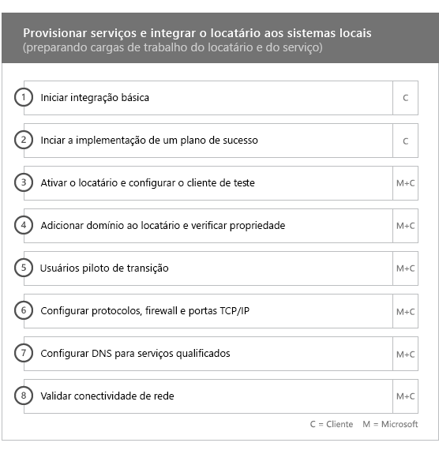

# Fases de integração e migração

> [!CAUTION]
> Este conteúdo não é mais atual e está agendado para remoção. Use o Sumário na navegação à esquerda para o conteúdo atual.

A integração do Office 365 tem quatro fases principais: Iniciar, Avaliar, Corrigir e Habilitar. Elas podem ser seguidas por uma fase opcional de migração de dados, como mostra a imagem a seguir.
  

  
> [!NOTE]
>Para saber mais sobre a adesão e migração para o Office 365 US Government, confira [Integração e migração para o Office 365 US Government](US-Gov-appendix-onboarding-and-migration.md). 

Para tarefas detalhadas para cada fase, confira [Responsibilities do FastTrack](O365-fasttrack-responsibilities.md) e [Suas responsabilidades](O365-your-responsibilities.md).
  
## Fase Iniciar

Após adquirir o número e tipos de licença apropriados, siga as orientações do email de confirmação de compra para associar as licenças ao seu locatário existente ou ao novo locatário. 
  
Você pode obter ajuda no [centro de administração do Microsoft 365](https://go.microsoft.com/fwlink/?linkid=2032704) ou no [site do FastTrack](https://go.microsoft.com/fwlink/?linkid=780698). 

Para obter ajuda pelo [centro de administração do Microsoft 365](https://go.microsoft.com/fwlink/?linkid=2032704), o administrador deve entrar no centro de administração e clicar no widget **Precisa de ajuda?**. 

Para obter ajuda no [site do FastTrack](https://go.microsoft.com/fwlink/?linkid=780698): 
1.    Acesse o [site do FastTrack](https://go.microsoft.com/fwlink/?linkid=780698). 
2.    Selecione **Solicitar Assistência com o Microsoft 365** em **ações rápidas** na parte superior da página inicial.
3.    Preencha o formulário **Solicitar Assistência com o Microsoft 365**.
  
Os parceiros também podem obter ajuda no [site do FastTrack](https://go.microsoft.com/fwlink/?linkid=780698) em nome de um cliente da seguinte forma:
1.    Acesse o [site do FastTrack](https://go.microsoft.com/fwlink/?linkid=780698). 
2.    Selecione **Solicitar Assistência com o Microsoft 365** em **ações rápidas** na parte superior da página inicial.
3.    Procure o seu cliente inserindo o nome dele, domínio ou TPID (Identificador de Ponto de Confiança).
4.    Selecione o cliente nos resultados da pesquisa.
5.    Preencha o formulário **Solicitar Assistência com o Microsoft 365**.

Você pode também solicitar ajuda ao Centro FastTrack no [site do FastTrack](https://go.microsoft.com/fwlink/?linkid=780698), na lista de serviços disponíveis para o seu locatário. 
    
Durante essa fase, podemos discutir o processo de integração, verificar seus dados e configurar uma reunião inicial. Isso inclui trabalhar em conjunto para entender como você pretende usar o serviço e quais são as metas e planos da organização para impulsionar o uso do serviço.
  

  
## Fase Avaliar

O Gerente do FastTrack realiza uma chamada interativa de planejamento com você e sua equipe de adoção. Apresentamos os recursos dos serviços qualificados adquiridos, as principais bases necessárias para o sucesso, a metodologia para incentivar o uso do serviço e os cenários que você pode usar para aproveitar os serviços. Podemos ajudá-lo no planejamento de sucesso e fornecer comentários sobre as áreas principais (conforme necessário).
  
Os Especialistas do FastTrack trabalham com você para avaliar seu ambiente de origem e seus requisitos. Fornecemos ferramentas para recolher dados sobre o seu ambiente e damos orientações através da estimativa dos requisitos de largura de banda e da avaliação de seus navegadores da Internet, sistemas operacionais clientes, DNS (sistema de nomes de domínio), rede, infraestrutura e sistema de identidade para determinar se é necessário fazer alterações antes da integração. 
  
Baseado em suas configurações atuais, fornecemos um plano de correção que define seu ambiente de origem, conforme os requisitos mínimos para a integração ao Office 365 e, se necessário, para a migração de caixas de correio e/ou dados ocorrer com êxito. Oferecemos um conjunto de atividades sugeridas para aumentar a adoção e o valor do usuário final. Também configuramos chamadas de ponto de verificação adequadas para a fase Corrigir.
  

  
## Fase Corrigir

Você realiza as tarefas do plano de correção baseadas no seu ambiente de origem, a fim de cumprir os requisitos necessários para integrar, adotar e migrar cada serviço.
  

  
Também fornecemos um conjunto de atividades sugeridas para aumentar a adoção e o valor do usuário final. Antes de começar a fase Habilitar, verificaremos em conjunto os resultados das atividades de correção para garantir que você está pronto para continuar. 
  
Durante esta fase, o Gerente do FastTrack trabalha com você no planejamento de sucesso, mostrando os recursos corretos e práticas recomendadas para fornecer orientações de forma a disponibilizar o serviço para sua organização e incentivar o uso entre os serviços.
  
## Fase Habilitar

Quando todas as atividades de correção estiverem concluídas, o foco passará a ser configurar a infraestrutura básica para o consumo de serviço, provisionando o Office 365 e conduzindo as atividades para gerar adoção do serviço. 
  
## Serviços básicos

A integração básica envolve o provisionamento do serviço e a integração de identidade e locatário. Também inclui etapas para fornecer uma base para serviços de integração como o Exchange Online, o SharePoint Online e o Skype for Business Online. Você e seu Gerente do FastTrack continuam a ser eficazes no planejamento de reuniões de status para avaliar o progresso em relação às metas e determinar a ajuda adicional que você precisa.
  

  

  
> [!NOTE]
> WAP significa Web Application Proxy (Proxy de Aplicativo da Web). SSL significa Secure Sockets Layer (Camada de Soquetes Seguros). SDS significa School Data Sync (Sincronização de Dados Escolares). Para saber mais sobre SDS, confira [Bem-vindo ao Microsoft School Data Sync](https://go.microsoft.com/fwlink/?linkid=871480). 
  
A integração de um ou mais serviços qualificados poderá começar quando a integração básica estiver concluída.
  
## Exchange Online

Em relação ao Exchange Online, vamos orientá-lo pelo processo de modo que sua organização fique pronta para usar o email. As etapas exatas, de acordo com o ambiente de origem e os planos de migração de email, podem incluir orientações para:
- Configurar os recursos do EOP (Proteção do Exchange Online) para todos os domínios habilitados para email validados no Office 365.
    > [!NOTE]
    > Seus registros de Troca de Mensagens (Mail Exchange, MX) devem apontar para o Office 365. 
- Configurar o recurso de Proteção Avançada Contra Ameaças do Office 365 (ATP) se ele fizer parte do seu serviço de assinatura. Para obter mais informações, confira[Proteção avançada contra ameaças do Office365](#office-365-advanced-threat-protection).
- Configurar o recurso de DLP (prevenção contra perda de dados) para todos os domínios habilitados para email validados no Office 365 como parte do serviço de assinatura. Isso é feito quando seus registros MX apontam para o Office 365.  
- Configurar o recurso de OME (Criptografia de Mensagens do Office 365) para todos os domínios habilitados para email validados no Office 365 como parte do serviço de assinatura. Isso é feito quando seus registros MX apontam para o Office 365.  

> [!NOTE]
> O serviço de Replicação de Caixa de Correio (MRS) tenta migrar os emais do Gerenciamento de Direitos de Informação (IRM) da caixa de correio local para a caixa de correio correspondente do Exchange Online. A capacidade de ler o conteúdo protegido após a migração depende dos modelos de mapeamento e cópia do cliente dos Serviços Gerenciados por Direitos do Active Directory (AD RMS) para o Serviço de Gerenciamento de Direitos do Azure (Azure RMS).

- Configurar portas do firewall.
- Configurar o DNS, incluindo a Descoberta Automática exigida, o SPF (Sender Policy Framework) e os registros MX (conforme necessário). 
- Configurando o fluxo de email entre seu ambiente de mensagens de origem e o Exchange Online (conforme a necessidade).
- Fornecer orientações para a migração de email do ambiente de mensagens de origem para o Office 365.
- Configuração de clientes de caixa de correio (Outlook para Windows, Outlook na web e Outlook para iOS e Android).
    > [!NOTE]
    > Para saber mais sobre a migração de dados e emails, confira [Migração de dados](O365-data-migration.md). 
  

  
## SharePoint Online e OneDrive for Business

No SharePoint Online e OneDrive for Business, fornecemos instruções para:
- Configuração do DNS.
- Configurar portas do firewall.
- Provisionar usuários e licenças.   
- Configurar recursos híbridos do SharePoint, como pesquisa híbrida, sites híbridos, taxonomia híbrida, tipos de conteúdo, criação de sites de autoatendimento híbridos (SharePoint Server 2013 apenas), inicializador de aplicativos estendido, OneDrive for Business híbrido e sites extranet.
    
Os Especialistas do FastTrack fornecem orientações sobre a migração de dados para o Office 365 usando uma combinação de ferramentas e documentação, além de realizar tarefas de configuração, quando for aplicável e viável.
  

  
## OneDrive for Business

No OneDrive for Business, as etapas dependem de você estar usando o SharePoint e da versão dele. 
  

  
## Proteção Avançada contra Ameaças do Office 365

Na ATP do Office 365, fornecemos instruções para:
- Habilitação de Links Seguros, Anexos Seguros e anti-phishing. 
- Configuração de automação, investigação e resposta.
- Uso do Simulador de Ataques.
- Relatórios e análise de ameaças.

## Governança de Informações da Microsoft

Para Governança de Informações da Microsoft, nós fornecemos orientações para:

- Governança de Informações.
- Rótulos e diretivas de retenção.
- Gerenciamento de registros.
- Diretivas de exclusão.
- Conformidade da comunicação.
- Gerenciamento de risco interno 
- Descoberta Eletrônica Avançada.

## Proteção de Informações da Microsoft

Para a Proteção de Informações da Microsoft, nós fornecemos orientações para:
- Conheça seus dados através do explorador de conteúdo e do explorador de atividade.
- Rótulos de confidencialidade.
- Classificação de dados.
- Diretivas de proteção contra perda de dados (DLP) em bate-papos e canais do Microsoft Teams.
- Proteção de informações.
- Rotulagem unificada.

## Microsoft Teams

No Microsoft Teams, fornecemos instruções para:
- Confirmação dos requisitos mínimos.  
- Configurar portas do firewall.   
- Configuração do DNS. 
- Confirmação de que o Microsoft Teams está habilitado no seu locatário do Office 365.  
- Habilitação ou desabilitação de licenças de usuário.
    

## Skype for Business Online

No Skype for Business Online, fornecemos instruções para:
- Configurar portas do firewall.
- Configuração do DNS.   
- Criar contas para dispositivos do sistema.   
- Implantar um cliente Skype for Business online com suporte.  
- Estabeleça a configuração do servidor de domínio dividido entre seu ambiente de servidor local do Lync 2010, Lync 2013 ou Skype for Business 2015 e o locatário do Skype for Business online (se aplicável), Planos de Chamada, Transmissão de Reunião do Skype e Sistema Telefônico e Planos de Chamada (em mercados disponíveis).
    

  

  
## Power BI

No Power BI, fornecemos instruções para: 
- Atribuição de licenças do Power BI.
- Implantação do aplicativo do Power BI Desktop.
    
## Project Online

No Project Online, fornecemos instruções para:
  
- Verificar as funcionalidades básicas do SharePoint nos quais o Project Online se baseia.   
- Adicionar o serviço do Project Online ao locatário, inclusive adicionar assinaturas para os usuários.  
- Configurar o ERP (Pool de Recursos da Empresa). 
- Criando seu primeiro projeto. 
    

  
## Project Online Professional e Project Online Premium

No Project Online Professional e Project Online Premium, fornecemos instruções para:
- Solução de problemas de implantação.
- Atribuição de licenças de usuário final usando o [centro de administração do Microsoft 365](https://go.microsoft.com/fwlink/?linkid=2032704) e o Windows PowerShell.  
- Instalação do Cliente de Área de Trabalho do Microsoft Project Online pelo portal do Office 365 usando Clique para Executar.
- Definir as configurações de atualização usando a Ferramenta de Implantação do Office 365.  
- Configurar um único servidor de distribuição no local para o Cliente de Área de Trabalho do Microsoft Project Online, inclusive assistência com a criação de um arquivo configuration.xml para uso com a Ferramenta de Implantação do Office 365.  
- Conexão do Cliente de Área de Trabalho do Microsoft Project Online ao Project Online Professional ou Project Online Premium.
    

  
## Yammer Enterprise

No Yammer, fornecemos instruções para habilitar o serviço do Yammer Enterprise.
  
## Aplicativos do Microsoft 365

Nos Aplicativos do Microsoft 365, fornecemos diretrizes para:
- Solução de problemas de implantação.   
- Atribuir licenças baseadas em dispositivos e usuários finais usando o [Centro de administração do Microsoft 365](https://go.microsoft.com/fwlink/?linkid=2032704) e o Windows PowerShell. 
- Instalação de Aplicativos do Microsoft 365 pelo portal do Office 365 usando Clique para Executar.   
- Instalar os aplicativos do Office Mobile (como Outlook Mobile, Word Mobile, Excel Mobile e PowerPoint Mobile) em dispositivos iOS ou Android.   
- Definir as configurações de atualização usando a Ferramenta de Implantação do Office 365.   
- Seleção e configuração de uma instalação local ou na nuvem. 
- Criação do XML de configuração da Ferramenta de Implantação do Office com a Ferramenta de Personalização do Office ou XML nativo para configurar o pacote de implantação.  
- Implantação usando o Gerenciador de Configurações do Microsoft Endpoint, incluindo assistência na criação de pacotes do Gerenciador de Configurações do Microsoft Endpoint.
    

  
## Outlook para iOS e Android

Para o Outlook para iOS e Android, fornecemos instruções para:
- Baixe o Outlook para iOS e Android no Google Play e Apple App Store.
- Configurar contas e acessar a caixa de correio do Exchange Online.
