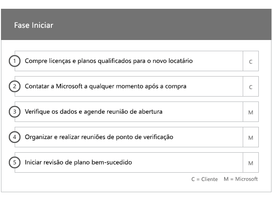

# Inclusão e a migração fases para o Office 365 governamentaisOnboarding and Migration Phases for Office 365 US Government

A integração do Office 365 tem quatro fases principais: Iniciar, Avaliar, Corrigir e Habilitar. Elas podem ser seguidas por uma fase opcional de migração de dados, como mostra a imagem a seguir.Office 365 onboarding has four primary phases—Initiate, Assess, Remediate, and Enable. You can follow these phases with an optional data migration phase as shown in the following figure.
  

  
Para conhecer tarefas detalhadas para cada fase, consulte [FastTrack responsabilidades para o Office 365 US governo](US-Gov-appendix-fasttrack-responsibilities.md) e [Suas responsabilidades para o Office 365 US governo](US-Gov-appendix-your-responsibilities.md).For detailed tasks for each phase, see [FastTrack Responsibilities for Office 365 US Government](US-Gov-appendix-fasttrack-responsibilities.md) and [Your Responsibilities for Office 365 US Government](US-Gov-appendix-your-responsibilities.md).
  
## Fase IniciarInitiate phase

Após adquirir o número e tipos de licença apropriados, siga as orientações do email de confirmação de compra para associar as licenças ao seu locatário existente ou ao novo locatário.After you purchase the appropriate number and types of licenses, follow the guidance from the purchase confirmation email to associate the licenses to your existing or new tenant. 
  
- Você pode obter ajuda no Centro de administração do Office 365 ou no [site FastTrack](https://go.microsoft.com/fwlink/?linkid=780698). Para obter ajuda através no Centro de administração do Office 365, o administrador deve entrar no centro de administração e clicar no widget **Precisa de ajuda?**. Para obter ajuda no [site FastTrack](https://go.microsoft.com/fwlink/?linkid=780698), conecte-se, clique em **Serviços** e preencha o formulário **Solicitar assistência para o Office 365**.You can get help through the Office 365 admin center or the [FastTrack site](https://go.microsoft.com/fwlink/?linkid=780698). To get help through the Office 365 admin center, your admin signs into the admin center and then clicks the **Need help?** widget. To get help through the [FastTrack site](https://go.microsoft.com/fwlink/?linkid=780698), sign in, click **Services**, and complete the **Request Assistance for Office 365** form. 
    > [!NOTE]
    >  Se você tiver um parceiro no locatário do Office 365, não verá essa opção. Peça ajuda ao seu parceiro.If you have a partner listed in your Office 365 tenant, you won't see this option. Please consult your partner for assistance. 
- Os parceiros também podem obter ajuda no [site FastTrack](https://go.microsoft.com/fwlink/?linkid=780698) em nome de um cliente. Para fazer isso, o parceiro entra no site, seleciona o registro do cliente, clica em **Serviços** e preenche o formulário **Solicitar assistência para o Office 365**.Partners can also get help through the [FastTrack site](https://go.microsoft.com/fwlink/?linkid=780698) on behalf of a customer. To do so, the partner signs in to the site, selects the customer record, clicks **Services**, and completes the **Request Assistance for Office 365** form.    
- Você pode também solicitar ajuda ao Centro FastTrack no [site do FastTrack](https://go.microsoft.com/fwlink/?linkid=780698) na lista de serviços disponíveis para o seu locatário.You can also ask for FastTrack Center help from the [FastTrack site](https://go.microsoft.com/fwlink/?linkid=780698) in the list of available services for your tenant. 
    
Durante esta fase, discutimos o processo de integração, verificamos dados e agendamos uma reunião de apresentação.During this phase, we discuss the onboarding process, verify your data, and set up a kickoff meeting.
  
Isso inclui trabalhar com você para entender como você pretende usar o serviço e as metas e planos de sua organização para incentivar o uso do serviço.This includes working with you to understand how you intend to use the service and your organization's goals and plans to drive service usage.
  

  
## Fase AvaliarAssess phase

O Gerente do FastTrack realiza uma chamada interativa de planejamento com você e sua equipe de adoção. Apresentamos os recursos dos serviços qualificados adquiridos, as principais bases necessárias para o sucesso, a metodologia para incentivar o uso do serviço e os cenários que você pode usar para aproveitar os serviços. Podemos ajudá-lo no planejamento de sucesso e fornecer comentários sobre as áreas principais (conforme necessário).Your FastTrack Manager conducts an interactive success planning call with you and your adoption team. This introduces you to the capabilities of the eligible services you purchased, the key foundations you need for success, the methodology for driving usage of the service, and scenarios you can use to get value from the services. We assist you in success planning and provide feedback on key areas (as needed).
  
Os especialistas de FastTrack trabalham com você para avaliar seu ambiente de origem e os requisitos. Fornecemos ferramentas para coletar dados sobre seu ambiente e guiá-lo por meio de estimativa de requisitos de largura de banda e avaliar seus navegadores da internet, sistemas operacionais do cliente, sistema de nome de domínio (DNS), rede, infraestrutura e sistema de identidade para Determine se as alterações são necessárias para inclusão.FastTrack Specialists work with you to assess your source environment and the requirements. We provide tools for you to gather data about your environment and guide you through estimating bandwidth requirements and assessing your internet browsers, client operating systems, Domain Name System (DNS), network, infrastructure, and identity system to determine if any changes are required for onboarding. 
  
Baseado em suas configurações atuais, fornecemos um plano de correção que define seu ambiente de origem, conforme os requisitos mínimos para a integração ao Office 365 e, se necessário, para a migração de caixas de correio e/ou dados ocorrer com êxito. Oferecemos um conjunto de atividades sugeridas para aumentar a adoção e o valor do usuário final. Também configuramos chamadas de ponto de verificação adequadas para a fase Corrigir.Based on your current setup, we provide a remediation plan that brings your source environment up to the minimum requirements for successful onboarding to Office 365 and, if needed, for successful mailbox and/or data migration. We provide a set of suggested activities to increase end user value and adoption. We also set up appropriate checkpoint calls for the Remediate phase.
  

  
## Fase CorrigirRemediate phase

Você realiza as tarefas do plano de correção baseadas no seu ambiente de origem, a fim de cumprir os requisitos necessários para integrar, adotar e migrar cada serviço.You do the remediation tasks based on your source environment so that you meet the requirements for onboarding, adopting, and migrating each service as needed.
  

  
Também fornecemos um conjunto de atividades sugeridas para aumentar a adoção e o valor do usuário final. Antes de começar a fase Habilitar, verificaremos em conjunto os resultados das atividades de correção para garantir que você está pronto para continuar.We also provide a set of suggested activities to increase end user value and adoption. Before beginning the Enable phase, we jointly verify the outcomes of the remediation activities to make sure you're ready to proceed. 
  
Durante esta fase, o Gerente do FastTrack trabalha com você no planejamento de sucesso, mostrando os recursos corretos e práticas recomendadas para fornecer orientações de forma a disponibilizar o serviço para sua organização e incentivar o uso entre os serviços.During this phase, your FastTrack Manager works with you on success planning, guiding you to the right resources and best practices to provide guidance for you to make the service available to your organization and drive usage across the services.
  
## Fase HabilitarEnable phase

Quando todas as atividades de correção estiverem concluídas, o foco passará a ser configurar a infraestrutura básica para o consumo de serviço, provisionando o Office 365 e conduzindo as atividades para gerar adoção do serviço.When all remediation activities are complete, the focus shifts to configuring the core infrastructure for service consumption, provisioning Office 365, and conducting the activities to drive service adoption. 
  
## Serviços básicosCore

A integração básica envolve o provisionamento do serviço e a integração de identidade e locatário. Também inclui etapas para fornecer uma base para serviços de integração como o Exchange Online, o SharePoint Online e o Skype for Business Online. Você e seu Gerente do FastTrack continuam a ser eficazes no planejamento de reuniões de status para avaliar o progresso em relação às metas e determinar a ajuda adicional que você precisa.Core onboarding involves service provisioning and tenant and identity integration. It also includes steps for providing a foundation for onboarding services like Exchange Online, SharePoint Online, and Skype for Business Online. You and your FastTrack Manager continue to have success planning checkpoint meetings to evaluate progress against your goals and determine what further assistance you need.
  

  

  
> [!NOTE]
> WAP significa Web Application Proxy (Proxy de Aplicativo da Web). SSL significa Secure Sockets Layer (Camada de Soquetes Seguros). SDS significa School Data Sync (Sincronização de Dados Escolares). Para saber mais sobre SDS, confira [Bem-vindo ao Microsoft School Data Sync](https://go.microsoft.com/fwlink/?linkid=871480).WAP stands for Web Application Proxy. SSL stands for Secure Sockets Layer. SDS stands for School Data Sync. For more information on SDS, see [Welcome to Microsoft School Data Sync](https://go.microsoft.com/fwlink/?linkid=871480). 
  
A integração de um ou mais serviços qualificados poderá começar quando a integração básica estiver concluída.Onboarding for one or more eligible services can begin once core onboarding is finished.
  
## Exchange OnlineExchange Online

Em relação ao Exchange Online, vamos orientá-lo pelo processo de modo que sua organização fique pronta para usar o email. As etapas exatas, de acordo com o ambiente de origem e os planos de migração de email, podem incluir orientações para:For Exchange Online, we guide you through the process to get your organization ready to use email. The exact steps, depending on your source environment and your email migration plans, can include providing guidance for:
  
- Configurar os recursos do EOP (Proteção do Exchange Online) para todos os domínios habilitados para email validados no Office 365.Setting up Exchange Online Protection (EOP) features for all mail-enabled domains validated in Office 365.   
    > [!NOTE]
    > Seus registros de Troca de Mensagens (Mail Exchange, MX) devem apontar para o Office 365.Your mail exchange (MX) records must point to Office 365.   
- Configurar o recurso do Proteção Avançada Contra Ameaças do Exchange Online (ATP) se ele fizer parte do seu serviço de assinatura depois que os registros MX apontarem para o Office 365. Este recurso está configurado como parte das configurações antimalware do Proteção do Exchange Online.Setting up the Exchange Online Advanced Threat Protection (ATP) feature if it's part of your subscription service once your MX records point to Office 365. This feature is configured as part of the Exchange Online Protection antimalware settings.   
- Configurar portas do firewall.Configuring firewall ports.   
- Configurar o DNS, incluindo a Descoberta Automática exigida, o SPF (Sender Policy Framework) e os registros MX (conforme necessário).Setting up DNS, including the required Autodiscover, sender policy framework (SPF), and MX records (as needed).     
- Configurando o fluxo de email entre seu ambiente de mensagens de origem e o Exchange Online (conforme a necessidade).Setting up email flow between your source messaging environment and Exchange Online (as needed).   
- Fornecer orientações para a migração de email do ambiente de mensagens de origem para o Office 365.Undertaking mail migration from your source messaging environment to Office 365.   
    > [!NOTE]
    > Para saber mais sobre a migração de dados e emails, confira [Migração de dados](data-migration.md).For more information on mail and data migration, see [Data Migration](data-migration.md). 
  

  
## SharePoint Online e OneDrive for BusinessSharePoint Online and OneDrive for Business

No SharePoint Online e OneDrive for Business, fornecemos instruções para:For SharePoint Online and OneDrive for Business, we provide guidance for: 
- Configuração do DNS.Setting up DNS.   
- Configurar portas do firewall.Configuring firewall ports.   
- Provisionar usuários e licenças.Provisioning users and licenses.   
- Configurar recursos do Implantação Híbrida do SharePoint, como pesquisa híbrida, sites híbridos, taxonomia híbrida, tipos de conteúdo, criação de sites de autoatendimento híbridos (SharePoint Server 2013 apenas), inicializador de aplicativos estendido, OneDrive for Business híbrido e sites extranet.Configuring SharePoint Hybrid features, like hybrid search, hybrid sites, hybrid taxonomy, content types, hybrid self-service site creation (SharePoint Server 2013 only), extended app launcher, hybrid OneDrive for Business, and extranet sites.
    
Os Especialistas do FastTrack fornecem orientações sobre a migração de dados para o Office 365 usando uma combinação de ferramentas e documentação, além de realizar tarefas de configuração, quando for aplicável e viável.FastTrack Specialists provide guidance on data migration to Office 365 by using a combination of tools and documentation and by performing configuration tasks where applicable and feasible.
  

  
## OneDrive for BusinessOneDrive for Business

No OneDrive for Business, as etapas dependem de você estar usando o SharePoint e da versão dele.For OneDrive for Business, the steps depend on if you're currently using SharePoint, and if so, which version. 
  

  
## Skype for Business OnlineSkype for Business Online

No Skype for Business Online, fornecemos instruções para:For Skype for Business Online, we provide guidance for: 
- Configurar portas do firewall.Configuring firewall ports.    
- Configuração do DNS.Setting up DNS.    
- Criar contas para dispositivos do sistema.Creating accounts for any room system devices.    
- Implantar um cliente Skype for Business online com suporte.Deploying a supported Skype for Business Online client.   
- Estabelecendo a configuração do servidor de domínio dividido entre locais Lync 2010, Lync 2013, ou Skype para ambiente de servidor de negócios 2015 e Skype para Business Online locatários (se aplicável).Establishing split domain server configuration between your on-premises Lync 2010, Lync 2013, or Skype for Business 2015 server environment and Skype for Business Online tenant (if applicable).
- Habilitando chamar planos, Skype transmissão de reunião e sistema telefônico e planos de chamada (em mercados disponíveis – não disponíveis nos planos GCC alta ou DoD).Enabling Calling Plans, Skype Meeting Broadcast, and Phone System and Calling Plans (in available markets – not available in GCC High or DoD plans). 
    

  

  
## Microsoft TeamsMicrosoft Teams

> [!NOTE]
> A seguir não está disponível nos planos GCC alta ou DoD.The following isn’t available in GCC High or DoD plans.

No Microsoft Teams, fornecemos instruções para:For Microsoft Teams, we provide guidance for: 
- Confirmação dos requisitos mínimos.Confirming minimum requirements.   
- Configurar portas do firewall.Configuring firewall ports.   
- Configuração do DNS.Setting up DNS.  
- Confirmação de que o Microsoft Teams está habilitado no seu locatário do Office 365.Confirming Microsoft Teams is enabled on your Office 365 tenant.    
- Habilitação ou desabilitação de licenças de usuário.Enabling or disabling user licenses.
    

  
## Power BIPower BI

No Power BI, fornecemos instruções para:For Power BI, we provide guidance for:  
- Atribuição de licenças do Power BI.Assigning Power BI licenses.    
- Implantação do aplicativo do Power BI Desktop.Deploying the Power BI Desktop app.   
## Project OnlineProject Online

No Project Online, fornecemos instruções para:For Project Online, we provide guidance for: 
- Verificar as funcionalidades básicas do SharePoint nos quais o Project Online se baseia.Verifying basic SharePoint functionality that Project Online relies on.    
- Adicionar o serviço do Project Online ao locatário, inclusive adicionar assinaturas para os usuários.Adding the Project Online service to your tenant (including adding subscriptions to users).    
- Configurar o ERP (Pool de Recursos da Empresa).Setting up the Enterprise Resource Pool (ERP).   
- Criando seu primeiro projeto.Creating your first project. 
    

  
## Yammer EnterpriseYammer Enterprise

No Yammer, fornecemos instruções para habilitar o serviço do Yammer Enterprise.For Yammer, we provide guidance for enabling the Yammer Enterprise service.

> [!NOTE]
> O Yammer Enterprise não é um componente do Office 365 conosco agências governamentais, mas pode ser adquirido sem custo adicional, como uma oferta autônoma para cada usuário licenciados para o Office 365 GCC em. Essa oferta está atualmente limitada a clientes que comprar GCC do Office 365 em Enterprise Agreements e Enterprise Agreements de assinatura. Yammer não está disponível nos planos GCC alta ou DoD.Yammer Enterprise isn’t a component of Office 365 US Government but can be acquired at no cost as a standalone offer for each user licensed for Office 365 in GCC. This offer is currently limited to customers that purchase Office 365 GCC under Enterprise Agreements and Enterprise Subscription Agreements. Yammer isn’t available in GCC High or DoD plans. 
  
## Office 365 ProPlusOffice 365 ProPlus

No Office 365 ProPlus, fornecemos instruções para:For Office 365 ProPlus, we provide guidance for: 
- Solução de problemas de implantação.Addressing deployment issues.    
- Atribuição de licenças de usuário final usando o Centro de administração do Office 365 e o Windows PowerShell.Assigning end-user licenses using the Office 365 admin center and Windows PowerShell.    
- Instalação do Office 365 ProPlus pelo portal do Office 365 usando Clique para Executar.Installing Office 365 ProPlus from the Office 365 portal using Click-to-Run.    
- Instalar os aplicativos do Office Mobile (como Outlook Mobile, Word Mobile, Excel Mobile e PowerPoint Mobile) em dispositivos iOS, Android ou Windows Mobile.Installing Office Mobile apps (like Outlook Mobile, Word Mobile, Excel Mobile, and PowerPoint Mobile) on your iOS, Android, or Windows Mobile devices.   
- Definir configurações de atualização usando a Ferramenta de Implantação do Office.Configuring update settings using the Office Deployment Tool.    
- Configurar um servidor de distribuição local único para o Office 365 ProPlus, incluindo orientação para criar um arquivo configuration.xml para uso com a Ferramenta de Implantação do Office.Setting up a single on-site distribution server for Office 365 ProPlus, including assistance with the creation of a configuration.xml file for use with the Office Deployment Tool.    
- A implantação usando o Microsoft System Center Configuration Manager, incluindo orientações para criar um pacote do System Center Configuration Manager.Deployment using Microsoft System Center Configuration Manager, including assistance with the creation of System Center Configuration Manager packaging.
    

  

  

