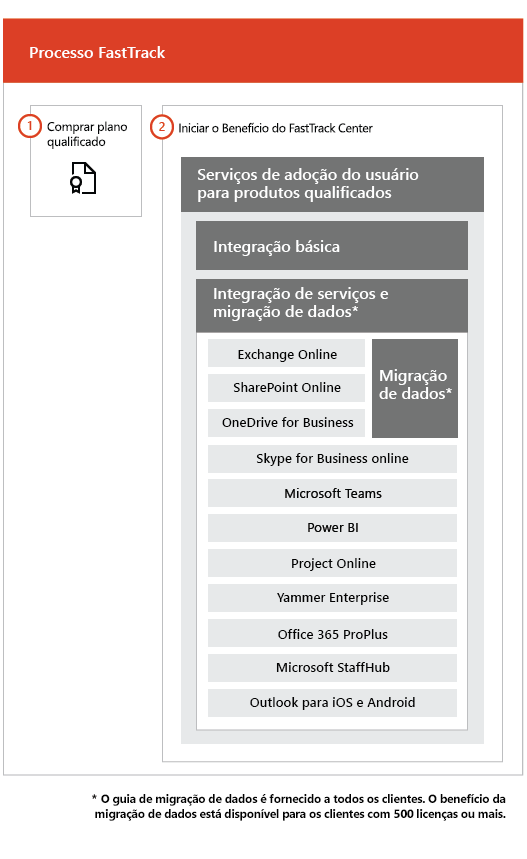

# O processo FastTrackThe FastTrack Process

O processo FastTrack oferece integração e serviços de adoção do usuário. The FastTrack process provides onboarding and user adoption services. 
  
A integração consiste em:Onboarding consists of:
  
- *Integração básica* – as tarefas necessárias para configuração de locatários e integração ao Azure Active Directory (Azure AD), se necessário. A integração básica também fornece a linha de base para integração de outros serviços qualificados.Core onboarding — These are tasks required for tenant configuration and integration with Azure Active Directory (Azure AD) if needed. Core onboarding also provides the baseline for onboarding other eligible services. 
    
- *Serviço de migração e integração* – as tarefas de integração de serviço habilitam cenários em seu locatário. A migração de dados (incluindo emails e arquivos) é abordada em [Migração de Dados](data-migration.md).*Service onboarding and migration* — Service onboarding tasks enable scenarios in your tenant. Data migration (including email and files) is covered in [Data Migration](data-migration.md). 
    
Os serviços de adoção do usuário são compostos por tarefas que oferecem orientações para garantir que os usuários estejam cientes dos serviços qualificados e de que podem usá-los para impulsionar o valor comercial. Esta assistência ocorre paralelamente às atividades de integração.User adoption services are comprised of tasks that provide guidance for you to ensure your users are aware of the eligible services and can use them to drive business value. This assistance occurs in parallel to onboarding activities.
  
> [!NOTE]
> O FastTrack oferece aos clientes uma abordagem recomendada, orientação e práticas recomendadas elaboradas para fornecer resultados rápidos e previsíveis. Se você optar por implantar de forma diferente dessa orientação, sua experiência de integração e o uso do serviço poderão ser afetados. A orientação é definida como uma combinação de assistência verbal e escrita. Quando os Especialistas do FastTrack oferecem orientação, o pessoal do FastTrack não pode atuar em seu nome. Você pode usar serviços do FastTrack para integrar e adotar qualquer carga de trabalho do produto qualificado, desde que sua assinatura seja atual.FastTrack provides customers with a recommended approach, guidance, and best practices engineered to deliver quick and predictable outcomes. If you choose to deploy outside of this guidance, your onboarding experience and usage of the service may be impacted. Guidance is defined as a combination of verbal and written assistance. When FastTrack Specialists provide guidance, FastTrack personnel cannot act on your behalf. You can use FastTrack services to onboard and adopt any qualifying product workload as long as your subscription is current. 
  
## O processo de integraçãoThe onboarding process

O diagrama a seguir ilustra o processo de integração.The following diagram illustrates the onboarding process.
  

  
- Você pode obter ajuda no Centro de administração do Office 365 ou no [site FastTrack](https://go.microsoft.com/fwlink/?linkid=780698). Para obter ajuda através no Centro de administração do Office 365, o administrador deve entrar no centro de administração e clicar no widget **Precisa de ajuda?**. Para obter ajuda no [site FastTrack](https://go.microsoft.com/fwlink/?linkid=780698), conecte-se, clique em **Serviços** e preencha o formulário **Solicitar assistência para o Office 365**.You can get help through the Office 365 admin center or the [FastTrack site](https://go.microsoft.com/fwlink/?linkid=780698). To get help through the Office 365 admin center, your admin signs into the admin center and then clicks the **Need help?** widget. To get help through the [FastTrack site](https://go.microsoft.com/fwlink/?linkid=780698), sign in, click **Services**, and complete the **Request Assistance for Office 365** form. 
    
    > [!NOTE]
    >  Se você tiver um parceiro no locatário do Office 365, não verá essa opção. Peça ajuda ao seu parceiro.If you have a partner listed in your Office 365 tenant, you won't see this option. Please consult your partner for assistance. 
  
    Você pode também solicitar ajuda ao Centro FastTrack no [site do FastTrack](https://go.microsoft.com/fwlink/?linkid=780698) na lista de serviços disponíveis para o seu locatário.You can also ask for FastTrack Center help from the [FastTrack site](https://go.microsoft.com/fwlink/?linkid=780698) in the list of available services for your tenant. 
    
    Assim que a assistência de integração for iniciada, definiremos um cronograma de reuniões online.Once onboarding assistance starts, we set up a schedule of online meetings.
    
- Os parceiros também podem obter ajuda no [site FastTrack](https://go.microsoft.com/fwlink/?linkid=780698) em nome de um cliente. Para fazer isso, o parceiro entra no site, seleciona o registro do cliente, clica em **Serviços** e preenche o formulário **Solicitar assistência para o Office 365**.Partners can also get help through the [FastTrack site](https://go.microsoft.com/fwlink/?linkid=780698) on behalf of a customer. To do so, the partner signs in to the site, selects the customer record, clicks **Services**, and completes the **Request Assistance for Office 365** form. 
    
- A equipe do FastTrack oferece orientações com a integração principal e a de serviço e o planejamento bem-sucedido da adoção de serviços qualificados.The FastTrack team provides guidance with core and service onboarding and planning successful adoption of eligible services.
    
- Os Especialistas do FastTrack oferecem todos os serviços de integração, migração e adoção de usuário remotamente.FastTrack Specialists provide all onboarding, migration, and user adoption services remotely.
    
- Os Especialistas do FastTrack ajudam remotamente usando uma combinação de ferramentas e documentação publicada.FastTrack Specialists assist you remotely by using a combination of tools and published documentation.
    
- O FastTrack Center oferece assistência e está disponível durante o horário comercial normal de cada região.The FastTrack Center provides assistance and is available during normal business hours for a given region.
    
- A assistência está disponível em chinês tradicional e em chinês simplificado (os recursos falam apenas mandarim), inglês, francês, alemão, italiano, japonês, coreano, português (Brasil), espanhol, tailandês e vietnamita.Assistance is available in Traditional Chinese and Simplified Chinese (resources speak Mandarin only), English, French, German, Italian, Japanese, Korean, Portuguese (Brazil), Spanish, Thai, and Vietnamese.
    
-  Os Especialistas do FastTrack podem trabalhar diretamente com você ou seu representante.FastTrack Specialists can work directly with you or your representative. 
    
- Os Especialistas do FastTrack fornecem orientações de migração de dados e email.FastTrack Specialists provide email and data migration guidance.
    

  

